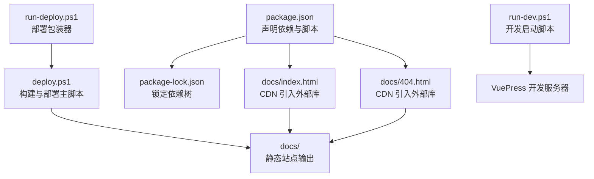
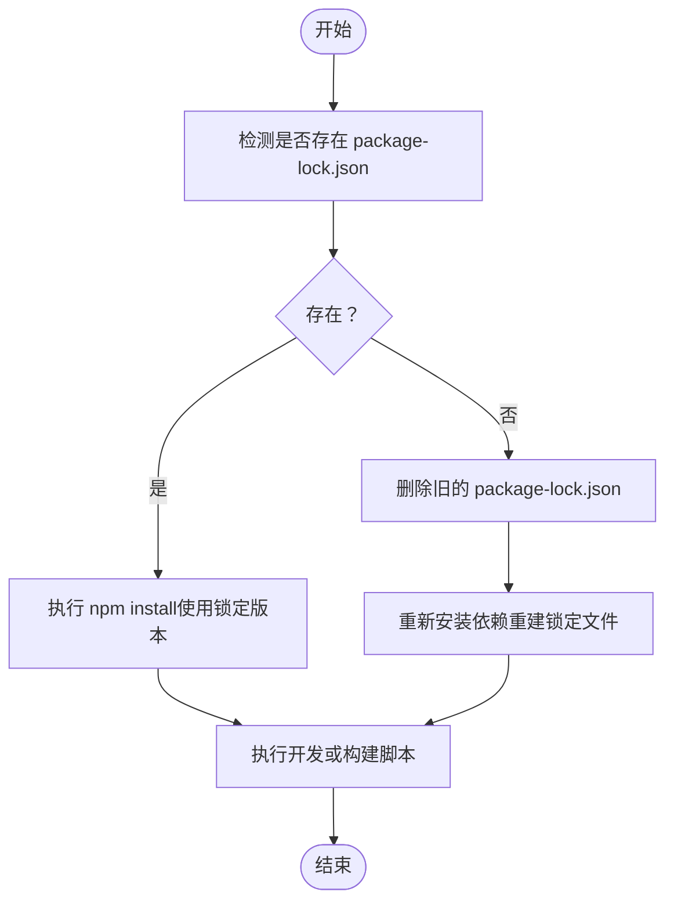
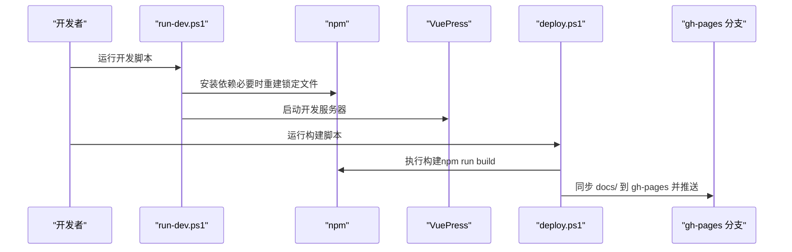

# 依赖管理

<cite>
**本文引用的文件列表**
- [package.json](file://package.json)
- [package-lock.json](file://package-lock.json)
- [docs/index.html](file://docs/index.html)
- [docs/404.html](file://docs/404.html)
- [run-dev.ps1](file://run-dev.ps1)
- [deploy.ps1](file://deploy.ps1)
- [run-deploy.ps1](file://run-deploy.ps1)
- [README.md](file://README.md)
</cite>

## 目录
1. [简介](#简介)
2. [项目结构与依赖相关文件](#项目结构与依赖相关文件)
3. [核心依赖清单与用途](#核心依赖清单与用途)
4. [依赖锁定与一致性保障](#依赖锁定与一致性保障)
5. [CDN 外部库版本管理策略](#cdn-外部库版本管理策略)
6. [安全更新依赖的流程与最佳实践](#安全更新依赖的流程与最佳实践)
7. [依赖冲突排查与解决](#依赖冲突排查与解决)
8. [架构与数据流概览](#架构与数据流概览)
9. [故障排查指南](#故障排查指南)
10. [结论](#结论)

## 简介
本文件系统性梳理本项目的依赖管理体系，覆盖：
- 声明式依赖（生产依赖 element-ui、开发依赖 vuepress）
- 锁定文件（package-lock.json）对一致性的作用
- 通过 CDN 引入的外部库（Vue.js、SVGAPlayerWeb、Lottie Web）的版本管理策略与风险
- 安全更新依赖与新增包的流程
- 依赖冲突的排查与解决方法

## 项目结构与依赖相关文件
- 核心配置文件
  - package.json：定义项目名称、版本、描述、脚本、生产依赖与开发依赖
  - package-lock.json：锁定依赖树与精确版本，确保跨环境一致性
- 文档站点与构建
  - docs/index.html、docs/404.html：文档站点入口页面，包含通过 CDN 引入的外部库脚本
  - run-dev.ps1、run-deploy.ps1、deploy.ps1：一键开发与部署脚本，驱动 VuePress 构建与发布
- 其他
  - README.md：项目简要说明

图表来源
- [package.json](file://package.json#L1-L19)
- [package-lock.json](file://package-lock.json#L1-L200)
- [docs/index.html](file://docs/index.html#L1-L22)
- [docs/404.html](file://docs/404.html#L1-L23)
- [run-dev.ps1](file://run-dev.ps1#L1-L67)
- [run-deploy.ps1](file://run-deploy.ps1#L1-L15)
- [deploy.ps1](file://deploy.ps1#L1-L156)

章节来源
- [package.json](file://package.json#L1-L19)
- [package-lock.json](file://package-lock.json#L1-L200)
- [docs/index.html](file://docs/index.html#L1-L22)
- [docs/404.html](file://docs/404.html#L1-L23)
- [run-dev.ps1](file://run-dev.ps1#L1-L67)
- [run-deploy.ps1](file://run-deploy.ps1#L1-L15)
- [deploy.ps1](file://deploy.ps1#L1-L156)
- [README.md](file://README.md#L1-L3)

## 核心依赖清单与用途
- 生产依赖
  - element-ui：基于 Vue 的桌面端组件库，用于提供 UI 组件能力（例如布局、表单、表格等）。版本采用语义化版本范围，允许小版本与补丁版本自动升级，但不接受破坏性变更。
- 开发依赖
  - vuepress：文档站点生成工具，支持 Markdown 写作与静态站点构建；项目脚本中提供 dev 与 build 两个命令，分别用于本地开发与构建。

章节来源
- [package.json](file://package.json#L1-L19)

## 依赖锁定与一致性保障
- package-lock.json 的作用
  - 记录完整依赖树与精确版本号，确保不同机器与 CI 环境安装一致的依赖版本
  - 降低因 semver 范围导致的意外升级风险
- 项目中的使用方式
  - run-dev.ps1 中在某些情况下会删除 package-lock.json 并重新安装，以强制重建锁文件，从而保证依赖树稳定
  - deploy.ps1 通过 npm run build 触发 VuePress 构建，构建产物位于 docs/，随后由部署脚本同步至 gh-pages 分支

图表来源
- [run-dev.ps1](file://run-dev.ps1#L1-L67)
- [deploy.ps1](file://deploy.ps1#L1-L156)

章节来源
- [run-dev.ps1](file://run-dev.ps1#L1-L67)
- [deploy.ps1](file://deploy.ps1#L1-L156)

## CDN 外部库版本管理策略
- 当前页面通过 CDN 引入以下外部库：
  - Vue.js：从 jsDelivr 获取稳定版
  - SVGAPlayerWeb：指定版本 2.3.1
  - Lottie Web：指定版本 5.7.6
- 版本管理策略
  - 固定版本：通过明确版本号降低运行时不确定性
  - CDN 来源：便于快速加载，减少打包体积
- 潜在风险
  - CDN 可用性与网络稳定性
  - 不同 CDN 间的资源差异与缓存策略
  - 版本升级需同步更新 HTML 中的版本号，避免运行时不兼容
- 建议
  - 在 HTML 中保留清晰的版本注释，便于审计
  - 对关键版本建立“灰度验证”流程，先在测试分支验证再上线
  - 如需更可控的版本管理，可考虑迁移到 npm 包管理并通过构建工具统一打包

章节来源
- [docs/index.html](file://docs/index.html#L1-L22)
- [docs/404.html](file://docs/404.html#L1-L23)

## 安全更新依赖的流程与最佳实践
- 更新生产依赖（如 element-ui）
  - 步骤
    1) 使用包管理器更新到最新符合语义化版本范围的版本
    2) 运行项目进行功能与回归测试
    3) 若有破坏性变更，回滚并评估是否需要调整业务代码
    4) 提交更改并更新锁定文件
  - 注意事项
    - 关注语义化版本规则，优先允许小版本与补丁版本升级
    - 在 CI 中增加依赖扫描与兼容性测试
- 更新开发依赖（如 vuepress）
  - 步骤
    1) 评估新版本的破坏性变更与迁移成本
    2) 在独立分支上先行升级并验证构建与文档渲染
    3) 合并到主干并更新锁定文件
- 新增 npm 包
  - 步骤
    1) 明确用途与兼容性要求
    2) 选择合适的依赖类型（dependencies 或 devDependencies）
    3) 执行安装并运行测试
    4) 提交更改与锁定文件
  - 最佳实践
    - 优先选择活跃维护、社区认可度高的包
    - 控制依赖数量，定期清理不再使用的包
    - 对关键依赖建立“升级窗口期”，避免在高峰期升级

章节来源
- [package.json](file://package.json#L1-L19)
- [run-dev.ps1](file://run-dev.ps1#L1-L67)
- [deploy.ps1](file://deploy.ps1#L1-L156)

## 依赖冲突排查与解决
- 常见冲突场景
  - 不同包对同一依赖的不同版本要求
  - 开发依赖与生产依赖的版本不一致导致构建异常
- 排查步骤
  - 查看 package-lock.json 中的依赖树，定位冲突节点
  - 使用包管理器的依赖分析工具（如 npm ls）查看冲突详情
  - 临时降级或提升某依赖版本以验证问题根因
- 解决方法
  - 升级/降级冲突包到兼容版本
  - 将冲突包移出锁定范围（谨慎使用），改用别名或重定向
  - 在 CI 中加入依赖冲突检测任务
- 与本项目相关的注意事项
  - element-ui 与 Vue 版本需保持兼容
  - CDN 引入的外部库版本需与业务逻辑相匹配，避免运行时错误

章节来源
- [package-lock.json](file://package-lock.json#L1-L200)
- [docs/index.html](file://docs/index.html#L1-L22)
- [docs/404.html](file://docs/404.html#L1-L23)

## 架构与数据流概览
- 本地开发流程
  - run-dev.ps1 检测环境并安装依赖，随后调用 VuePress 开发服务器
- 构建与部署流程
  - deploy.ps1 调用 npm run build，产出 docs/ 静态站点
  - run-deploy.ps1 作为包装器，简化执行权限与交互
  - 部署脚本将 docs/ 内容同步到 gh-pages 分支并推送

图表来源
- [run-dev.ps1](file://run-dev.ps1#L1-L67)
- [deploy.ps1](file://deploy.ps1#L1-L156)

章节来源
- [run-dev.ps1](file://run-dev.ps1#L1-L67)
- [deploy.ps1](file://deploy.ps1#L1-L156)

## 故障排查指南
- 依赖安装失败
  - 症状：安装过程中断或提示网络错误
  - 处理：脚本已内置镜像源切换与重试逻辑；若仍失败，手动清理缓存后重试
- 构建失败
  - 症状：npm run build 报错
  - 处理：检查 docs/ 是否存在、依赖是否锁定一致、CDN 资源是否可用
- 部署失败
  - 症状：推送 gh-pages 失败
  - 处理：确认当前分支为 main、无未提交改动、网络与凭据正常

章节来源
- [run-dev.ps1](file://run-dev.ps1#L1-L67)
- [deploy.ps1](file://deploy.ps1#L1-L156)

## 结论
本项目采用“声明式依赖 + 锁定文件 + CDN 外部库”的组合模式：
- 生产依赖 element-ui 与开发依赖 vuepress 通过 package.json 明确声明
- package-lock.json 确保依赖一致性，run-dev.ps1 与 deploy.ps1 保障安装与构建流程稳定
- 通过 CDN 引入 Vue.js、SVGAPlayerWeb、Lottie Web，版本固定以降低运行时风险
- 建议持续关注依赖生态变化，结合本指南的安全更新流程与冲突排查方法，维持项目的长期可维护性