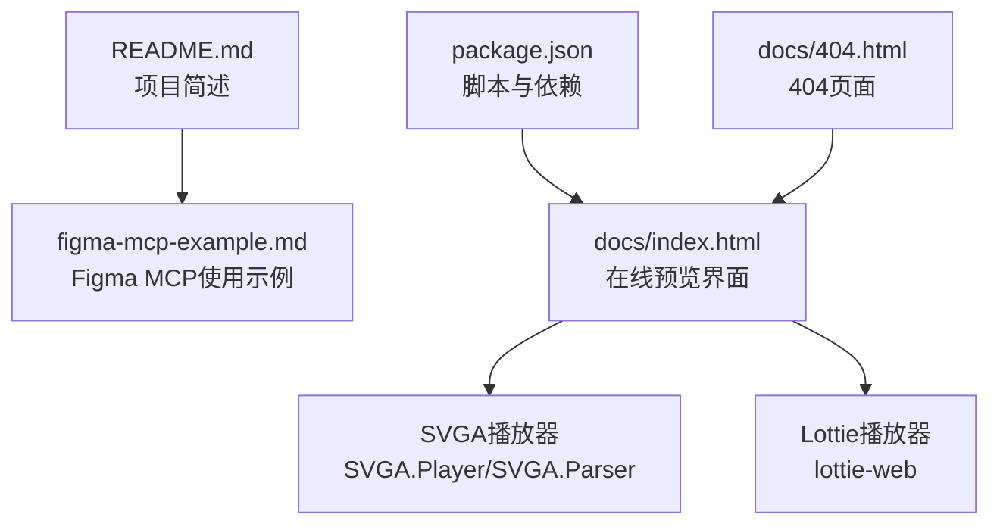
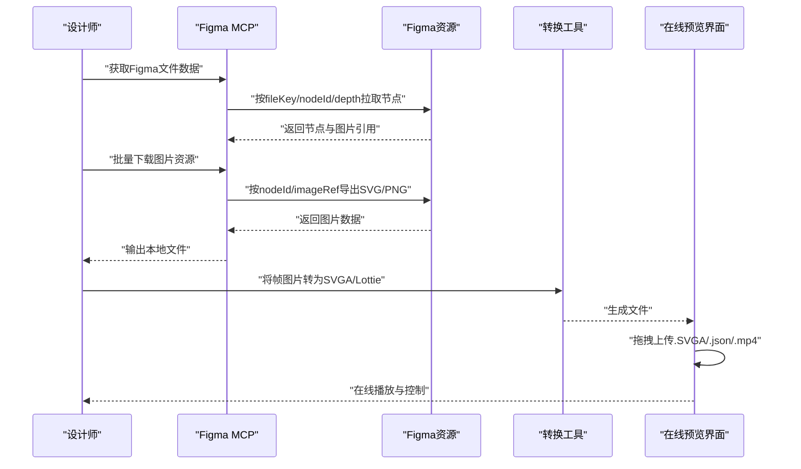
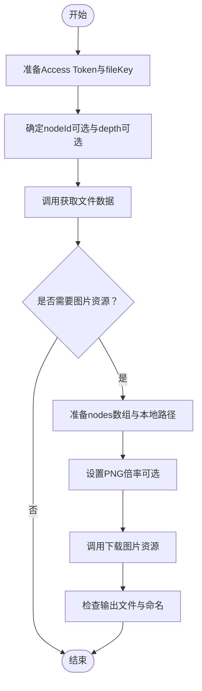
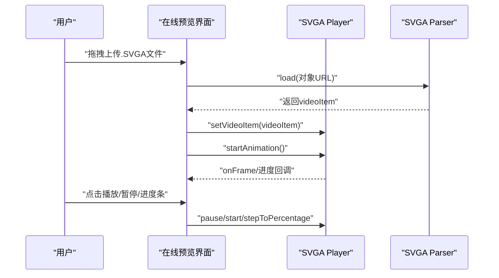
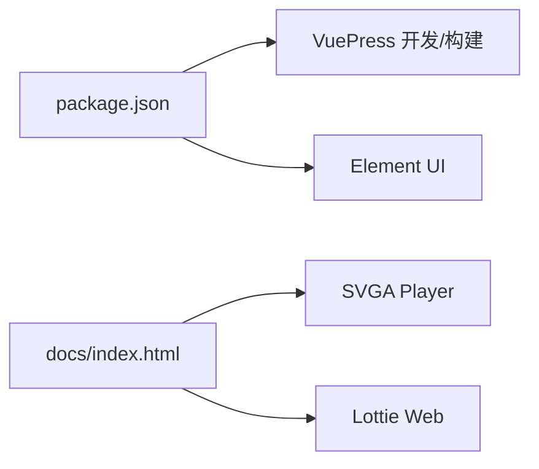

# Figma MCP集成指南

<cite>
**本文引用的文件**
- [README.md](file://README.md)
- [figma-mcp-example.md](file://figma-mcp-example.md)
- [package.json](file://package.json)
- [docs/index.html](file://docs/index.html)
- [docs/404.html](file://docs/404.html)
</cite>

## 目录
1. [简介](#简介)
2. [项目结构](#项目结构)
3. [核心组件](#核心组件)
4. [架构总览](#架构总览)
5. [详细组件分析](#详细组件分析)
6. [依赖关系分析](#依赖关系分析)
7. [性能考虑](#性能考虑)
8. [故障排查指南](#故障排查指南)
9. [结论](#结论)
10. [附录](#附录)

## 简介
本指南面向希望在设计到开发工作流中集成Figma MCP（Framelink Figma MCP）与本SVGA/Lottie动画预览工具的用户。通过该集成，你可以：
- 从Figma获取设计文件结构与节点信息
- 批量下载图标、插图等资源为SVG/PNG
- 将导出的帧图片转换为SVGA/Lottie格式
- 在本预览器中在线查看动画效果

本仓库提供了Figma MCP使用示例文档与一个基于Vue的在线预览界面，便于你快速落地上述流程。

章节来源
- file://README.md#L1-L3
- file://figma-mcp-example.md#L1-L172

## 项目结构
- 文档与示例
  - figma-mcp-example.md：Figma MCP使用示例与参数说明
  - docs/index.html：SVGA/Lottie动画在线预览界面（包含SVGA播放器与交互控件）
  - docs/404.html：404页面
- 构建与依赖
  - package.json：项目脚本与依赖（VuePress文档构建、Element UI）

图表来源
- [README.md](file://README.md#L1-L3)
- [figma-mcp-example.md](file://figma-mcp-example.md#L1-L172)
- [package.json](file://package.json#L1-L19)
- [docs/index.html](file://docs/index.html#L1-L1566)
- [docs/404.html](file://docs/404.html#L1-L23)

章节来源
- file://README.md#L1-L3
- file://package.json#L1-L19
- file://docs/index.html#L1-L1566
- file://docs/404.html#L1-L23

## 核心组件
- Figma MCP接口
  - 获取Figma文件数据：支持fileKey、nodeId、depth等参数
  - 下载Figma图片资源：支持多节点批量下载、PNG倍率、裁剪等
- 在线预览界面
  - 支持拖拽上传.SVGA/.json/.mp4
  - 提供播放/暂停、进度条、帧率/时长/内存等信息展示
  - 支持主题切换、背景色选择、缩放与平移

章节来源
- file://figma-mcp-example.md#L1-L172
- file://docs/index.html#L1110-L1566

## 架构总览
下图展示了从Figma MCP到预览器的整体工作流：

图表来源
- [figma-mcp-example.md](file://figma-mcp-example.md#L1-L172)
- [docs/index.html](file://docs/index.html#L1110-L1566)

## 详细组件分析

### 组件A：Figma MCP使用示例
- 关键能力
  - 获取文件数据：传入fileKey；可选nodeId与depth
  - 下载图片资源：传入fileKey、本地路径、节点数组（含nodeId、fileName、imageRef、裁剪与尺寸需求）、PNG倍率
- 使用要点
  - Access Token需正确配置
  - fileKey来自Figma文件URL
  - nodeId格式严格，建议从Figma链接中复制并转换
  - PNG导出需提供imageRef
  - 支持批量下载与自动创建目录

图表来源
- [figma-mcp-example.md](file://figma-mcp-example.md#L1-L172)

章节来源
- file://figma-mcp-example.md#L1-L172

### 组件B：在线预览界面（SVGA/Lottie）
- 技术栈
  - Vue 2 + SVGA Player + Lottie Web
  - 播放器初始化、文件解析、事件回调、进度控制
- 交互能力
  - 拖拽上传.SVGA/.json/.mp4
  - 播放/暂停、进度跳转
  - 帧率/尺寸/时长/内存占用信息
  - 主题切换、背景色选择、缩放与平移

图表来源
- [docs/index.html](file://docs/index.html#L1110-L1566)

章节来源
- file://docs/index.html#L1110-L1566

## 依赖关系分析
- 构建与运行
  - VuePress用于文档构建与部署
  - Element UI作为UI组件库
- 运行时依赖
  - SVGA Player与Lottie Web用于动画播放
- 项目脚本
  - dev：本地开发
  - build：静态站点构建

图表来源
- [package.json](file://package.json#L1-L19)
- [docs/index.html](file://docs/index.html#L1-L150)

章节来源
- file://package.json#L1-L19
- file://docs/index.html#L1-L150

## 性能考虑
- 资源下载
  - PNG导出倍率越大，文件体积与网络开销越高，建议按实际展示尺寸合理设置
  - 批量下载时注意并发与磁盘写入速度，避免阻塞
- 预览播放
  - 大尺寸高帧率动画会增加内存占用，建议在预览前对素材进行压缩与降采样
  - 合理设置背景色与Canvas尺寸，减少不必要的重绘
- 网络与缓存
  - 对频繁使用的图片资源可启用本地缓存策略
  - 在线预览时尽量使用CDN加速第三方库加载

## 故障排查指南
- 常见问题
  - 403 Forbidden：确认已正确配置Figma Access Token
  - 如何查找nodeId：在Figma中右键“复制链接”，从URL参数中提取并转换为“数字:数字”格式
  - SVG与PNG选择：矢量图标优先SVG，复杂图像与照片优先PNG并设置合适倍率
- 本地预览
  - 若无法播放，请检查浏览器控制台错误信息
  - 确认.SVGA/.json/.mp4文件格式正确且未损坏
  - 清空画布后重新上传，避免旧状态干扰

章节来源
- file://figma-mcp-example.md#L139-L161
- file://docs/index.html#L1218-L1242

## 结论
通过将Figma MCP与本在线预览器结合，你可以建立从设计到开发的闭环工作流：在Figma中设计关键帧，使用MCP批量导出帧图片，转换为SVGA/Lottie，并在本预览器中快速验证效果。建议在实际项目中根据资源规模与性能需求，合理设置导出参数与播放配置，以获得最佳体验。

## 附录
- 快速集成步骤
  1) 准备Figma Access Token与fileKey
  2) 获取节点结构与图片引用
  3) 批量下载SVG/PNG至本地
  4) 使用转换工具生成SVGA/Lottie
  5) 在预览器中拖拽上传并播放

章节来源
- file://figma-mcp-example.md#L103-L172
- file://docs/index.html#L1218-L1242