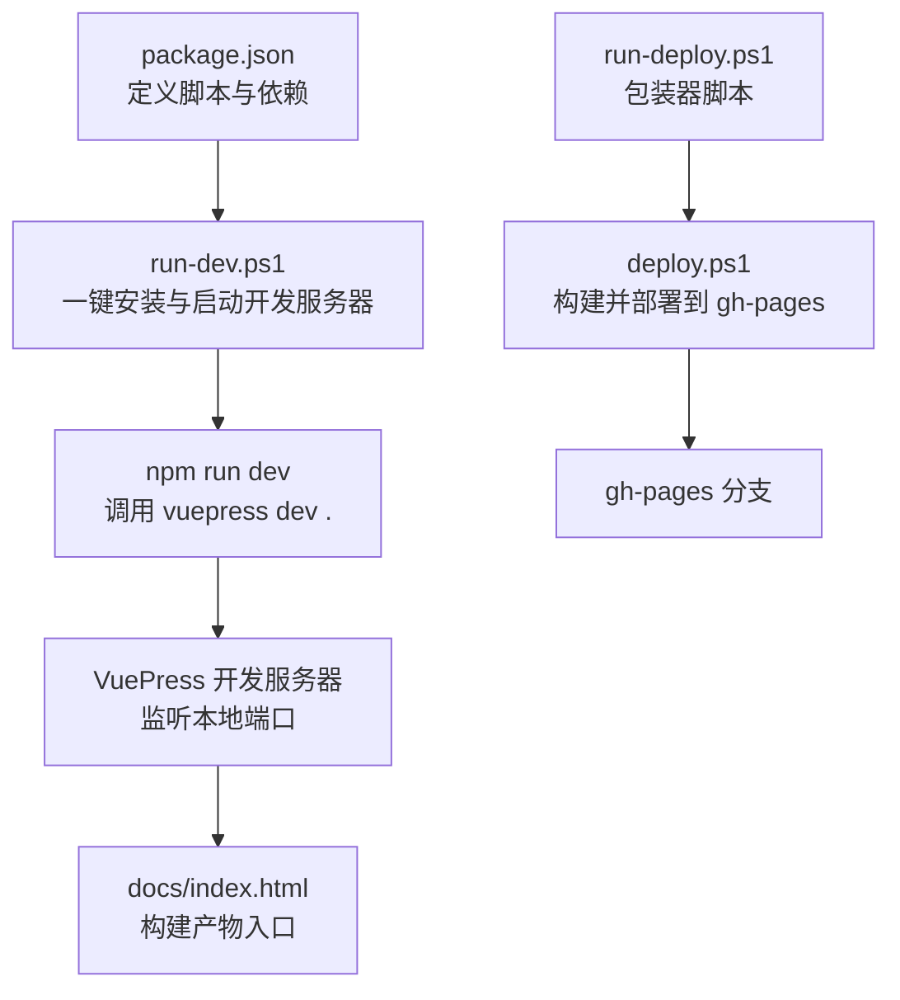
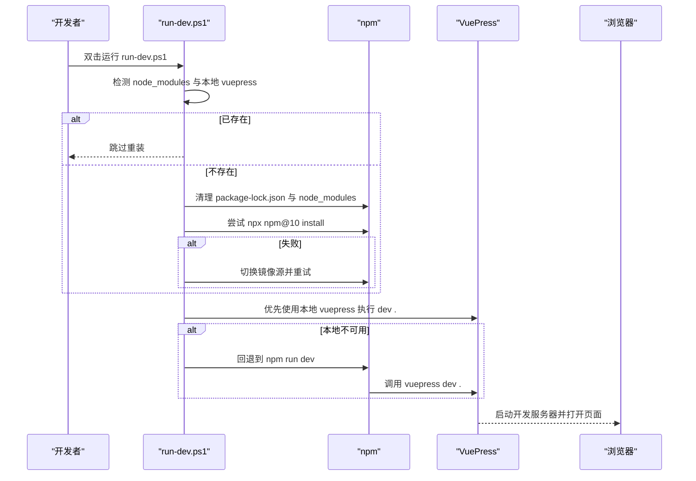
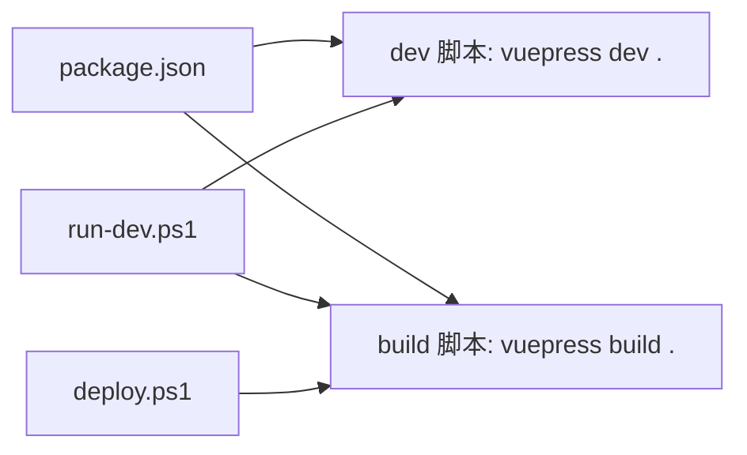

# 开发指南

<cite>
**本文引用的文件**
- [package.json](file://package.json)
- [run-dev.ps1](file://run-dev.ps1)
- [deploy.ps1](file://deploy.ps1)
- [run-deploy.ps1](file://run-deploy.ps1)
- [env-check.ps1](file://env-check.ps1)
- [README.md](file://README.md)
- [index.md](file://index.md)
</cite>

## 目录
1. [简介](#简介)
2. [项目结构](#项目结构)
3. [核心组件](#核心组件)
4. [架构总览](#架构总览)
5. [详细组件分析](#详细组件分析)
6. [依赖分析](#依赖分析)
7. [性能考虑](#性能考虑)
8. [故障排查指南](#故障排查指南)
9. [结论](#结论)
10. [附录](#附录)

## 简介
本指南面向需要在本地搭建与运行该 VuePress 文档站点的开发者，覆盖以下主题：
- 使用 npm 安装项目依赖
- 通过 Windows PowerShell 脚本一键启动 VuePress 开发服务器
- 解释 package.json 中 dev 脚本的工作原理
- 如何修改文档内容、调试前端代码以及验证功能变更
- 常见问题与解决方案（依赖安装失败、端口占用、脚本权限等）
- 强调在 Windows 环境下执行 PowerShell 脚本所需的执行策略配置

## 项目结构
该项目采用 VuePress 1.x 架构，文档源文件位于根目录下的 Markdown 文件中，构建产物输出至 docs 目录。仓库包含一组用于开发与部署的 PowerShell 辅助脚本，帮助在 Windows 环境下完成依赖安装、开发服务器启动、构建与部署流程。

图表来源
- [package.json](file://package.json#L1-L19)
- [run-dev.ps1](file://run-dev.ps1#L1-L67)
- [deploy.ps1](file://deploy.ps1#L1-L156)
- [run-deploy.ps1](file://run-deploy.ps1#L1-L15)

章节来源
- [package.json](file://package.json#L1-L19)
- [README.md](file://README.md#L1-L3)

## 核心组件
- 依赖管理与脚本
  - package.json 中定义了 dev 与 build 两个脚本，分别用于启动开发服务器与生成静态站点。
  - 依赖包括 VuePress 作为开发依赖，以及 Element-UI 作为运行时依赖。
- 开发启动脚本
  - run-dev.ps1 自动检测并清理旧依赖，尝试使用 npx 指定版本的 npm 安装依赖；若失败则切换为镜像源重试；最后根据可用性选择本地 vuepress、npx 指定版本或回退到 npm run dev 启动开发服务器。
- 部署脚本
  - deploy.ps1 先校验分支与工作区状态，再执行构建并将 docs 目录同步到 gh-pages 分支进行推送。
  - run-deploy.ps1 作为包装器，以“绕过”策略执行 deploy.ps1，便于在受限策略环境下快速运行。
- 环境检查脚本
  - env-check.ps1 输出 Node/npm/vuepress 等工具的检测结果与下一步建议，帮助快速定位环境问题。

章节来源
- [package.json](file://package.json#L1-L19)
- [run-dev.ps1](file://run-dev.ps1#L1-L67)
- [deploy.ps1](file://deploy.ps1#L1-L156)
- [run-deploy.ps1](file://run-deploy.ps1#L1-L15)
- [env-check.ps1](file://env-check.ps1#L1-L103)

## 架构总览
下面的序列图展示了从用户执行开发启动到浏览器访问的完整流程，以及 package.json 中 dev 脚本与 VuePress 的关系。

图表来源
- [run-dev.ps1](file://run-dev.ps1#L1-L67)
- [package.json](file://package.json#L1-L19)

## 详细组件分析

### package.json 中的 dev 脚本
- 脚本定义
  - dev: vuepress dev .
  - build: vuepress build .
- 工作原理
  - 当执行 npm run dev 时，npm 会调用 VuePress CLI 的开发模式命令，监听当前目录并启动热更新开发服务器。
  - VuePress 会读取项目中的 Markdown 文档与配置，生成可热更新的本地站点。
- 适用场景
  - 本地开发与调试文档内容、样式与交互。
  - 修改 index.md 等文档后，保存即可自动刷新页面。

章节来源
- [package.json](file://package.json#L1-L19)

### run-dev.ps1：一键安装与启动开发服务器
- 功能要点
  - 环境自检：检测 node_modules 与本地 vuepress 是否存在。
  - 清理与重装：删除旧的 package-lock.json 与 node_modules，确保干净安装。
  - 依赖安装：优先使用 npx 指定版本的 npm 安装依赖；若失败则切换到镜像源重试。
  - 启动开发服务器：优先使用本地 vuepress；否则回退到 npx 指定版本；最后回退到 npm run dev。
- 适用场景
  - 新手快速上手：无需手动输入复杂命令。
  - 环境不一致：自动处理镜像源与版本差异。

章节来源
- [run-dev.ps1](file://run-dev.ps1#L1-L67)

### deploy.ps1：构建与部署到 gh-pages
- 功能要点
  - 分支与工作区校验：确保当前在 main 分支且无未提交更改。
  - 构建：执行 npm run build 生成静态站点。
  - 交互式选择：支持本地预览或直接部署到 gh-pages。
  - 部署流程：清空 gh-pages 根目录，导出 main 分支的 docs 内容并复制到 gh-pages，提交并推送，最后切回 main。
- 适用场景
  - CI/CD 前的本地预览与最终发布。

章节来源
- [deploy.ps1](file://deploy.ps1#L1-L156)

### run-deploy.ps1：部署脚本包装器
- 功能要点
  - 以“绕过”策略执行 deploy.ps1，解决部分系统默认策略限制导致的脚本无法运行问题。
- 适用场景
  - Windows 环境下首次运行部署脚本或策略受限时。

章节来源
- [run-deploy.ps1](file://run-deploy.ps1#L1-L15)

### env-check.ps1：环境与项目检查
- 功能要点
  - 检查 Node/npm 是否在 PATH 中，显示版本与注册表信息。
  - 检查项目 package.json 存在性、脚本与依赖情况。
  - 检查本地 node_modules 与 vuepress 版本。
  - 给出下一步建议（安装依赖、启动开发等）。
- 适用场景
  - 快速诊断环境问题，减少排障时间。

章节来源
- [env-check.ps1](file://env-check.ps1#L1-L103)

### 文档内容与前端调试
- 文档内容修改
  - 修改 index.md 等 Markdown 文件后，保存即由开发服务器热更新。
  - 若涉及自定义组件或样式，可在 VuePress 配置中引入相应资源。
- 前端调试
  - 开发服务器启动后，浏览器访问对应端口进行调试。
  - 如需更深入的调试，可在本地安装依赖后使用 npm run dev 并结合浏览器开发者工具。
- 验证功能变更
  - 本地预览：通过 run-dev.ps1 或 npm run dev 启动后，访问页面验证内容与交互。
  - 构建验证：执行 npm run build，检查 docs 目录是否生成预期文件。

章节来源
- [index.md](file://index.md#L1-L1)
- [package.json](file://package.json#L1-L19)
- [run-dev.ps1](file://run-dev.ps1#L1-L67)

## 依赖分析
- 依赖关系
  - package.json 明确声明 VuePress 为开发依赖，Element-UI 为运行时依赖。
  - run-dev.ps1 与 deploy.ps1 均依赖 npm 与 PowerShell 环境。
- 版本与兼容性
  - run-dev.ps1 优先使用 npx 指定版本的 npm 安装依赖，有助于规避不同 npm 版本带来的差异。
  - deploy.ps1 通过 npm run build 触发 VuePress 构建，确保产物一致性。

图表来源
- [package.json](file://package.json#L1-L19)
- [run-dev.ps1](file://run-dev.ps1#L1-L67)
- [deploy.ps1](file://deploy.ps1#L1-L156)

章节来源
- [package.json](file://package.json#L1-L19)
- [run-dev.ps1](file://run-dev.ps1#L1-L67)
- [deploy.ps1](file://deploy.ps1#L1-L156)

## 性能考虑
- 依赖安装
  - 使用 npx 指定版本的 npm 安装依赖，可减少因 npm 版本差异导致的安装失败与耗时。
  - 镜像源重试机制可提升网络不稳定时的成功率。
- 开发服务器
  - VuePress 开发服务器默认监听本地端口，建议保持默认端口以便快速访问。
  - 减少不必要的第三方依赖与大体积资源，有助于提升热更新速度。
- 构建产物
  - 构建完成后检查 docs 目录大小与加载时间，必要时优化图片与脚本资源。

[本节为通用性能建议，不直接分析具体文件]

## 故障排查指南
- 依赖安装失败
  - 症状：node_modules 未生成或安装中断。
  - 排查步骤：
    - 使用 env-check.ps1 检查 Node/npm 是否在 PATH 中。
    - 在 run-dev.ps1 中观察是否触发镜像源重试逻辑。
    - 确认网络连通性与代理设置。
- 端口占用
  - 症状：开发服务器无法启动或提示端口被占用。
  - 排查步骤：
    - 查看开发服务器日志中显示的端口号。
    - 关闭占用端口的进程或调整 VuePress 配置中的端口。
- 脚本权限问题（Windows）
  - 症状：双击 PowerShell 脚本无响应或报错。
  - 解决方案：
    - 使用 run-deploy.ps1 包装器以“绕过”策略执行 deploy.ps1。
    - 在终端中以管理员权限运行 PowerShell，并设置执行策略为允许脚本执行。
- 本地 vuepress 不可用
  - 症状：run-dev.ps1 无法找到本地 vuepress。
  - 解决方案：
    - 确保 npm install 成功生成 node_modules。
    - 回退到 npm run dev 方式启动开发服务器。
- 分支与工作区状态不符
  - 症状：deploy.ps1 提示不在 main 分支或存在未提交更改。
  - 解决方案：
    - 切换到 main 分支并提交/暂存所有更改后再运行脚本。

章节来源
- [env-check.ps1](file://env-check.ps1#L1-L103)
- [run-dev.ps1](file://run-dev.ps1#L1-L67)
- [deploy.ps1](file://deploy.ps1#L1-L156)
- [run-deploy.ps1](file://run-deploy.ps1#L1-L15)

## 结论
通过本指南，您可以在 Windows 环境下高效地完成 VuePress 文档项目的本地开发与部署。推荐使用 run-dev.ps1 一键启动开发服务器，使用 env-check.ps1 快速诊断环境问题，使用 deploy.ps1 或 run-deploy.ps1 完成构建与部署。遇到问题时，按本指南的排查步骤逐一验证，通常可快速定位并解决问题。

[本节为总结性内容，不直接分析具体文件]

## 附录
- 快速开始清单
  - 确认已安装 Node.js 与 npm。
  - 在项目根目录双击 run-dev.ps1 启动开发服务器。
  - 修改 index.md 等文档后保存，浏览器自动刷新。
  - 需要预览构建效果时，执行 npm run build 或使用 deploy.ps1 的预览选项。
- PowerShell 执行策略建议
  - 若默认策略限制脚本执行，可使用 run-deploy.ps1 包装器以“绕过”策略运行 deploy.ps1。
  - 在受控环境中，可临时调整执行策略以允许本地脚本运行。

[本节为补充说明，不直接分析具体文件]