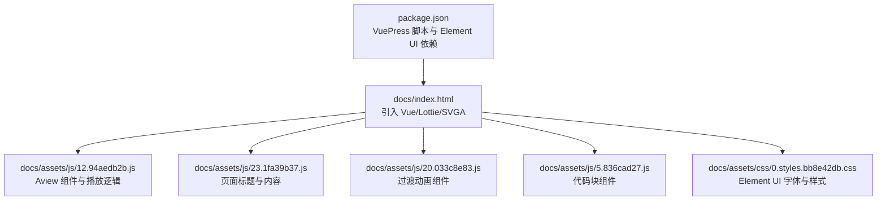
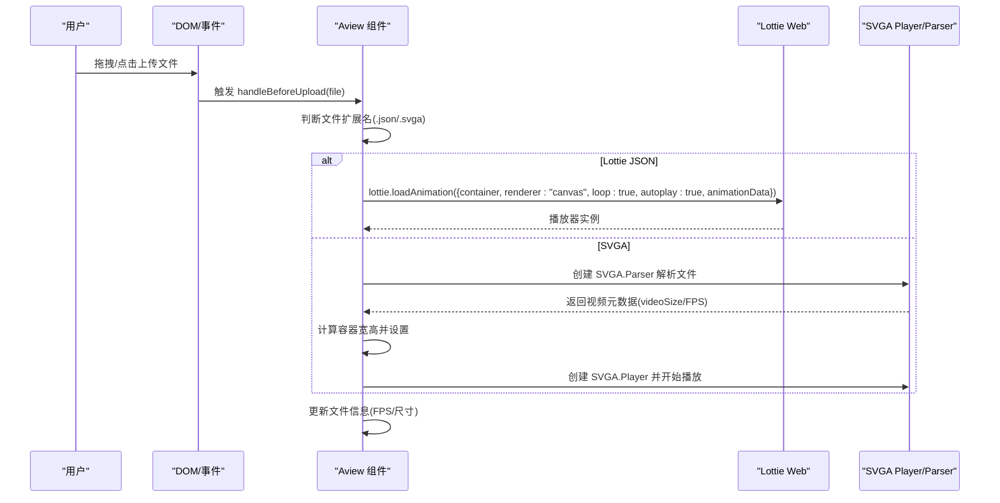
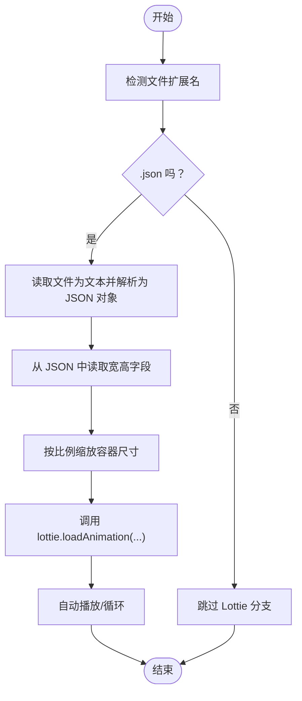
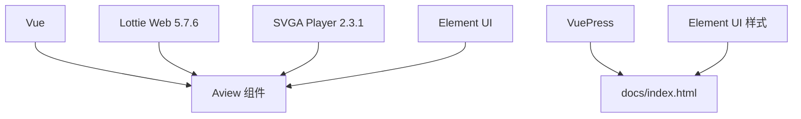

# Lottie动画预览

<cite>
**本文引用的文件**
- [docs/index.html](file://docs/index.html)
- [docs/404.html](file://docs/404.html)
- [docs/assets/js/12.94aedb2b.js](file://docs/assets/js/12.94aedb2b.js)
- [docs/assets/js/23.1fa39b37.js](file://docs/assets/js/23.1fa39b37.js)
- [docs/assets/js/20.033c8e83.js](file://docs/assets/js/20.033c8e83.js)
- [docs/assets/js/5.836cad27.js](file://docs/assets/js/5.836cad27.js)
- [docs/assets/css/0.styles.bb8e42db.css](file://docs/assets/css/0.styles.bb8e42db.css)
- [package.json](file://package.json)
</cite>

## 目录
1. [简介](#简介)
2. [项目结构](#项目结构)
3. [核心组件](#核心组件)
4. [架构总览](#架构总览)
5. [详细组件分析](#详细组件分析)
6. [依赖关系分析](#依赖关系分析)
7. [性能考量](#性能考量)
8. [故障排查指南](#故障排查指南)
9. [结论](#结论)
10. [附录](#附录)

## 简介
本项目为一个基于 VuePress 的静态站点，提供 SVGA 与 Lottie 动画在线预览能力。页面通过 CDN 引入 Vue、SVGA Player 与 Lottie Web 库，并在前端逻辑中实现拖拽上传、文件类型识别、容器尺寸适配与播放控制。Lottie Web 版本为 5.7.6，采用 canvas 渲染器，支持循环播放与自动播放。

## 项目结构
- 文档入口与资源：
  - docs/index.html：站点主入口，引入 Vue、SVGA Player 与 Lottie Web。
  - docs/404.html：404 页面，同样引入上述脚本。
  - docs/assets/js/*：打包后的前端模块，包含 A-viewer 组件与页面布局。
  - docs/assets/css/0.styles.bb8e42db.css：Element UI 字体与主题样式。
- 构建与运行：
  - package.json：定义了 VuePress 开发与构建脚本，依赖 Element UI。

图表来源
- [docs/index.html](file://docs/index.html#L1-L21)
- [docs/assets/js/12.94aedb2b.js](file://docs/assets/js/12.94aedb2b.js#L1-L1)
- [docs/assets/js/23.1fa39b37.js](file://docs/assets/js/23.1fa39b37.js#L1-L1)
- [docs/assets/js/20.033c8e83.js](file://docs/assets/js/20.033c8e83.js#L1-L1)
- [docs/assets/js/5.836cad27.js](file://docs/assets/js/5.836cad27.js#L1-L1)
- [docs/assets/css/0.styles.bb8e42db.css](file://docs/assets/css/0.styles.bb8e42db.css#L1-L1)
- [package.json](file://package.json#L1-L18)

章节来源
- [docs/index.html](file://docs/index.html#L1-L21)
- [package.json](file://package.json#L1-L18)

## 核心组件
- Aview 组件（核心播放器）
  - 负责接收拖拽上传的文件，根据文件扩展名判断类型并创建对应播放器实例。
  - 对于 Lottie JSON 文件，调用 lottie.loadAnimation() 完成加载与播放。
  - 对于 SVGA 文件，使用 SVGA.Player 与 SVGA.Parser 进行解析与播放。
  - 提供容器尺寸自适应逻辑，确保动画按比例缩放并在父容器内居中显示。
  - 提供销毁与重建逻辑，避免重复播放导致的内存泄漏或状态残留。

- 页面布局与交互
  - 页面标题与内容由独立组件负责渲染。
  - 提供 Element UI 的上传控件与颜色选择器，用于切换背景色与交互提示。

章节来源
- [docs/assets/js/12.94aedb2b.js](file://docs/assets/js/12.94aedb2b.js#L1-L1)
- [docs/assets/js/23.1fa39b37.js](file://docs/assets/js/23.1fa39b37.js#L1-L1)
- [docs/assets/js/20.033c8e83.js](file://docs/assets/js/20.033c8e83.js#L1-L1)
- [docs/assets/js/5.836cad27.js](file://docs/assets/js/5.836cad27.js#L1-L1)

## 架构总览
下图展示了页面加载、文件上传、类型识别与播放器初始化的整体流程。

图表来源
- [docs/assets/js/12.94aedb2b.js](file://docs/assets/js/12.94aedb2b.js#L1-L1)

## 详细组件分析

### Lottie 加载与播放流程
- 入口与触发
  - 通过 dragover 与 drop 事件监听，将文件对象传递给组件方法。
  - 在 handleBeforeUpload 中根据扩展名分流至 Lottie 或 SVGA 处理分支。
- Lottie 配置要点
  - 使用 canvas 渲染器，保证跨浏览器一致性。
  - 启用 loop 与 autoplay，提升预览体验。
  - animationData 直接传入解析后的 JSON 对象。
- 容器与尺寸
  - 读取 JSON 中的 w/h 或 width/height 字段，计算容器宽高并按比例缩放。
  - 若容器父元素存在特定类名，则同步调整父容器高度，确保布局稳定。
- 销毁与重建
  - 在新文件到来时先销毁旧播放器，避免重复创建导致的资源占用。
  - 重新初始化播放器，确保状态一致。

图表来源
- [docs/assets/js/12.94aedb2b.js](file://docs/assets/js/12.94aedb2b.js#L1-L1)

章节来源
- [docs/assets/js/12.94aedb2b.js](file://docs/assets/js/12.94aedb2b.js#L1-L1)

### SVGA 加载与播放流程
- 解析与播放
  - 使用 FileReader 将文件转为 ArrayBuffer 或文本，交由 SVGA.Parser 解析。
  - 从解析结果中读取 videoSize 与 FPS，作为元数据展示。
  - 创建 SVGA.Player 并开始播放。
- 容器与尺寸
  - 依据 videoSize 设置容器宽高，保持画面比例。
- 销毁与重建
  - 停止动画、清理子节点、释放对象 URL（如适用），然后重建播放器。

章节来源
- [docs/assets/js/12.94aedb2b.js](file://docs/assets/js/12.94aedb2b.js#L1-L1)

### Vue.js 集成与页面结构
- Vue 引入
  - index.html 通过 CDN 引入 Vue，使组件具备响应式与生命周期管理能力。
- Element UI
  - 样式文件引入 Element UI 字体与组件样式，用于上传按钮、颜色选择器等交互元素。
- 页面内容
  - 页面标题与内容由独立组件渲染，配合 Element UI 控件实现用户交互。

章节来源
- [docs/index.html](file://docs/index.html#L1-L21)
- [docs/assets/css/0.styles.bb8e42db.css](file://docs/assets/css/0.styles.bb8e42db.css#L1-L1)
- [docs/assets/js/23.1fa39b37.js](file://docs/assets/js/23.1fa39b37.js#L1-L1)

## 依赖关系分析
- 外部库
  - Vue：提供组件化与响应式能力。
  - Lottie Web 5.7.6：负责 Lottie JSON 的渲染与播放。
  - SVGA Player 2.3.1：负责 SVGA 文件的解析与播放。
- 内部模块
  - Aview 组件：统一处理文件上传、类型识别、播放器初始化与销毁。
  - Element UI 组件：上传、颜色选择器等交互控件。
- 构建与运行
  - VuePress：静态站点生成与开发服务器。
  - Element UI：UI 组件库依赖。

图表来源
- [docs/index.html](file://docs/index.html#L1-L21)
- [docs/assets/css/0.styles.bb8e42db.css](file://docs/assets/css/0.styles.bb8e42db.css#L1-L1)
- [package.json](file://package.json#L1-L18)

章节来源
- [docs/index.html](file://docs/index.html#L1-L21)
- [package.json](file://package.json#L1-L18)

## 性能考量
- 渲染器选择
  - Lottie 使用 canvas 渲染器，适合复杂路径与矢量图形，兼容性较好；若对性能敏感，可考虑 WebGL 渲染器（需满足设备与浏览器支持）。
- 容器尺寸与缩放
  - 通过读取 JSON 中的宽高字段并按比例缩放，避免过度拉伸或裁剪，减少重绘成本。
- 循环与自动播放
  - loop 与 autoplay 可简化用户操作，但需注意长时间播放的内存占用，建议在切换文件时及时销毁旧播放器。
- 资源预加载
  - index.html 中对样式与脚本进行了预加载与预取，有助于首屏加载速度，但需平衡网络带宽与缓存策略。

章节来源
- [docs/assets/js/12.94aedb2b.js](file://docs/assets/js/12.94aedb2b.js#L1-L1)
- [docs/index.html](file://docs/index.html#L1-L21)

## 故障排查指南
- 动画未显示
  - 检查容器是否存在且可见，确认已正确设置 container 与 renderer。
  - 确认 animationData 是否成功解析为对象。
- 图层缺失或内容异常
  - Lottie Web 5.7.6 对某些表达式与高级特性支持有限，建议在设计阶段避免使用不被支持的表达式或外部依赖。
  - 使用 LottieFiles 等工具进行预检，提前发现缺失图层或不兼容项。
- 字体渲染异常
  - Lottie Web 默认不加载外部字体，若动画依赖特定字体，需在设计阶段将字体栅格化或替换为系统可用字体。
- 性能问题
  - 减少复杂路径与大量图层，降低帧率或分辨率。
  - 切换文件时务必销毁旧播放器，避免内存泄漏。
- 404 页面
  - 若访问不存在路径，将进入 404 页面，检查路由与资源路径是否正确。

章节来源
- [docs/404.html](file://docs/404.html#L1-L13)
- [docs/assets/js/12.94aedb2b.js](file://docs/assets/js/12.94aedb2b.js#L1-L1)

## 结论
本项目通过 VuePress 与 CDN 引入 Vue、Lottie Web 与 SVGA Player，实现了对 Lottie JSON 与 SVGA 文件的在线预览。Aview 组件承担了文件上传、类型识别、播放器初始化与销毁等核心职责，并通过容器尺寸自适应与循环/自动播放提升了用户体验。针对动画缺失图层、表达式不支持与字体渲染异常等问题，建议在设计阶段进行预检与优化，并在生产环境中关注性能与内存占用。

## 附录
- 常见使用模式
  - 拖拽上传 .json 文件：自动识别为 Lottie，使用 canvas 渲染器加载并播放。
  - 拖拽上传 .svga 文件：自动识别为 SVGA，解析元数据后播放。
  - 切换背景色：通过颜色选择器改变容器背景，便于观察透明区域与边缘效果。
- 推荐工具
  - LottieFiles：用于预检 Lottie 动画，发现不兼容项与缺失图层。
  - Element UI：提供上传与交互控件，增强页面可用性。

章节来源
- [docs/assets/js/12.94aedb2b.js](file://docs/assets/js/12.94aedb2b.js#L1-L1)
- [docs/assets/js/23.1fa39b37.js](file://docs/assets/js/23.1fa39b37.js#L1-L1)
- [docs/assets/css/0.styles.bb8e42db.css](file://docs/assets/css/0.styles.bb8e42db.css#L1-L1)