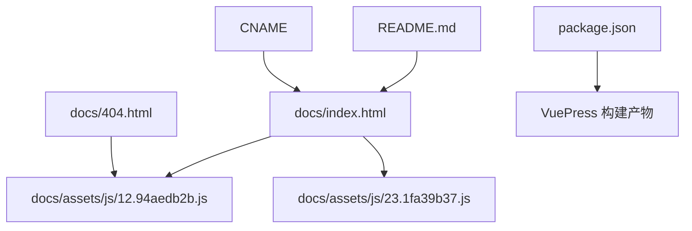
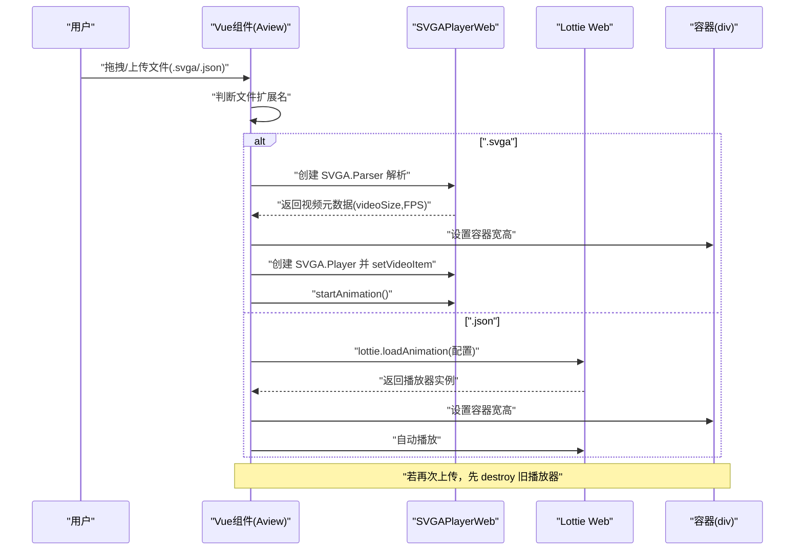
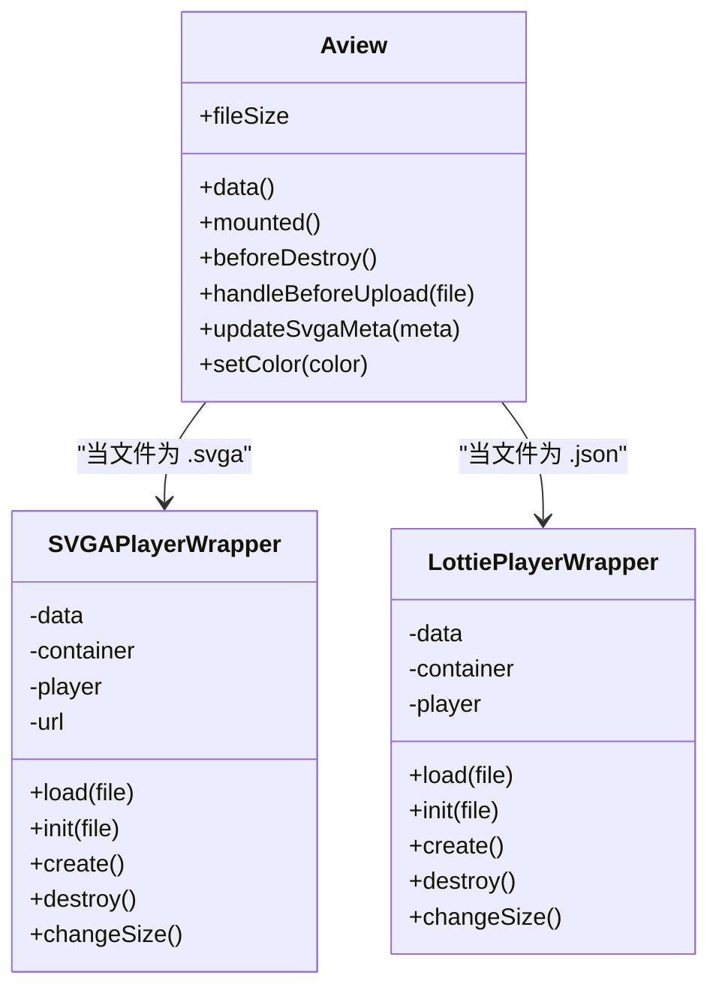
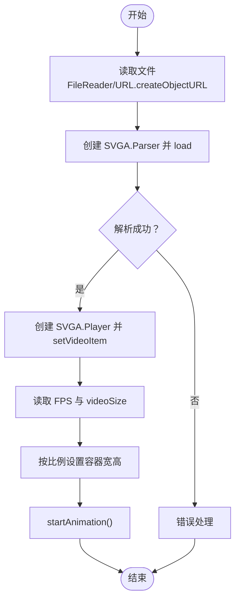
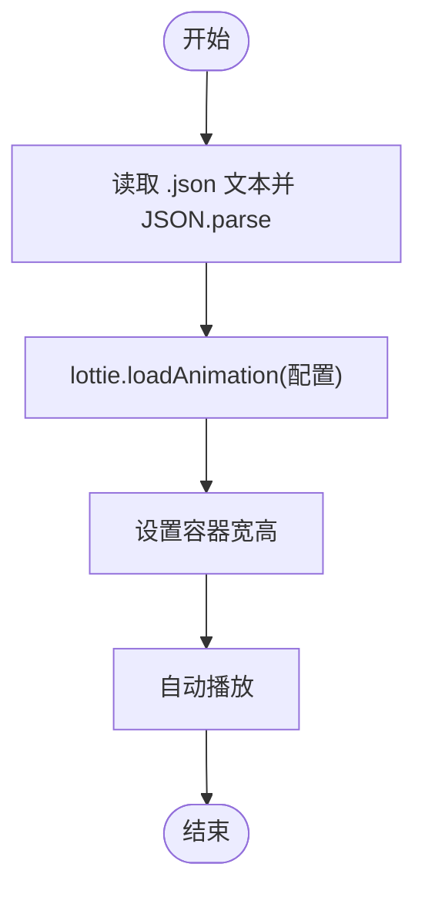
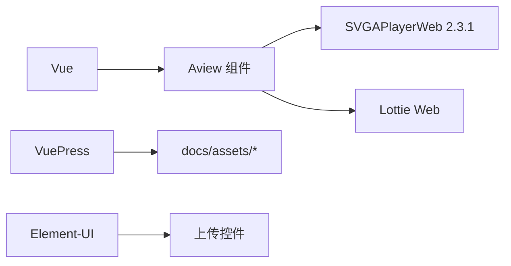

# SVGA动画预览

<cite>
**本文引用的文件**  
- [docs/index.html](file://docs/index.html)
- [figma-mcp-example.md](file://figma-mcp-example.md)
- [CNAME](file://CNAME)
</cite>

## 更新摘要
**变更内容**  
- 更新了UI界面描述，反映基于Figma设计的现代化单页应用布局
- 新增对固定高度底部控制面板（154px）的说明
- 增加实时帧数显示、暗色模式支持、改进的拖拽交互状态及工具提示系统的文档描述
- 更新了文件信息展示内容，包括帧率、尺寸、时长和内存占用等元数据
- 补充了与Figma MCP工具集成的工作流建议

## 目录
1. [简介](#简介)
2. [项目结构](#项目结构)
3. [核心组件](#核心组件)
4. [架构总览](#架构总览)
5. [详细组件分析](#详细组件分析)
6. [依赖关系分析](#依赖关系分析)
7. [性能考量](#性能考量)
8. [故障排查指南](#故障排查指南)
9. [结论](#结论)
10. [附录](#附录)

## 简介
本项目提供一个基于 Vue 的在线预览工具，用于加载与播放 SVGA 动画、带Alpha通道的MP4动画（YYEVA）以及 Lottie 动画。页面通过 CDN 引入 Vue 与 SVGAPlayerWeb 库，并在前端使用 Vue 组件完成拖拽上传、解析与播放控制。用户可直接上传本地 .svga 或 .json 文件，页面会根据文件类型选择对应的播放器进行渲染与播放；同时支持通过 URL 拖拽或上传的方式进行加载。系统已升级为现代化单页应用布局，包含固定高度的底部控制面板（154px），支持实时帧数更新、暗色模式切换、改进的拖拽交互状态以及新增的工具提示系统。

**Section sources**  
- [docs/index.html](file://docs/index.html#L1-L1566)

## 项目结构
- 文档与静态资源位于 docs 目录：  
  - HTML 入口：docs/index.html、docs/404.html  
  - 前端构建产物：docs/assets/js/*.js、docs/assets/css/*.css  
- 构建工具与依赖：  
  - package.json 中包含 VuePress 与 Element-UI 等依赖  
  - README.md 提供项目简述  
  - CNAME 指定域名  

**Diagram sources**  
- [docs/index.html](file://docs/index.html#L1-L21)
- [docs/404.html](file://docs/404.html#L1-L13)
- [package.json](file://package.json#L1-L19)
- [README.md](file://README.md#L1-L3)
- [CNAME](file://CNAME#L1-L1)

**Section sources**  
- [docs/index.html](file://docs/index.html#L1-L21)
- [docs/404.html](file://docs/404.html#L1-L13)
- [package.json](file://package.json#L1-L19)
- [README.md](file://README.md#L1-L3)
- [CNAME](file://CNAME#L1-L1)

## 核心组件
- 页面入口与依赖注入  
  - index.html 与 404.html 通过 CDN 引入 Vue、SVGAPlayerWeb 与 Lottie Web，确保运行时具备播放能力。  
- Vue 组件与播放器封装  
  - docs/assets/js/12.94aedb2b.js 中定义了 Aview 组件，负责：  
    - 接收拖拽/上传的文件  
    - 判断文件类型（.svga 或 .json）  
    - 初始化对应播放器（SVGA Player 或 Lottie）  
    - 设置容器尺寸与背景色  
    - 播放控制与销毁逻辑  
- 内容占位组件  
  - docs/assets/js/23.1fa39b37.js 提供基础内容组件，用于页面内容渲染。  

**Section sources**  
- [docs/index.html](file://docs/index.html#L1-L21)
- [docs/assets/js/12.94aedb2b.js](file://docs/assets/js/12.94aedb2b.js#L1-L1)
- [docs/assets/js/23.1fa39b37.js](file://docs/assets/js/23.1fa39b37.js#L1-L1)

## 架构总览
整体运行流程如下：  
- 用户在页面中拖拽或点击上传 .svga 或 .json 文件  
- 前端根据文件扩展名选择对应播放器：  
  - .svga 使用 SVGAPlayerWeb 的 SVGA.Player 与 SVGA.Parser 进行动画解析与播放  
  - .json 使用 Lottie Web 的 lottie.loadAnimation 进行播放  
- 播放器创建后，设置容器尺寸与背景色，自动开始播放  
- 若再次上传新文件，会先销毁旧播放器再创建新的  

**Diagram sources**  
- [docs/assets/js/12.94aedb2b.js](file://docs/assets/js/12.94aedb2b.js#L1-L1)
- [docs/index.html](file://docs/index.html#L1-L21)

## 详细组件分析

### 组件：Aview（播放器容器与控制）
- 职责  
  - 监听拖拽与 drop 事件，接收文件  
  - 根据文件扩展名选择播放器（SVGA 或 Lottie）  
  - 更新文件信息（名称、大小、FPS、尺寸）  
  - 控制播放器生命周期（创建、销毁、尺寸变更）  
- 关键交互  
  - mounted 阶段绑定 dragover/drop 事件  
  - handleBeforeUpload 处理上传逻辑  
  - updateSvgaMeta 更新 SVGA 元数据  
  - beforeDestroy 清理事件监听  
- 播放器封装类  
  - SVGA 播放器封装类：负责解析 .svga 文件、设置 videoItem、启动播放、销毁与尺寸调整  
  - Lottie 播放器封装类：负责解析 .json 数据、设置容器与参数、启动播放、销毁与尺寸调整  

**Diagram sources**  
- [docs/assets/js/12.94aedb2b.js](file://docs/assets/js/12.94aedb2b.js#L1-L1)

**Section sources**  
- [docs/assets/js/12.94aedb2b.js](file://docs/assets/js/12.94aedb2b.js#L1-L1)

### JavaScript 调用流程（SVGA）
- 步骤  
  - 读取文件为 ArrayBuffer 或 Blob URL  
  - 创建 SVGA.Parser 并加载数据  
  - 解析完成后，设置 SVGA.Player 的 VideoItem  
  - 获取视频元数据（FPS、videoSize），按比例设置容器宽高  
  - 启动播放  
  - 销毁时停止动画并清理 DOM  

**Diagram sources**  
- [docs/assets/js/12.94aedb2b.js](file://docs/assets/js/12.94aedb2b.js#L1-L1)

### JavaScript 调用流程（Lottie）
- 步骤  
  - 读取 .json 文本并解析为对象  
  - 使用 lottie.loadAnimation 创建播放器  
  - 设置容器宽高与渲染参数  
  - 自动播放  
  - 销毁时 stop 并 destroy  

**Diagram sources**  
- [docs/assets/js/12.94aedb2b.js](file://docs/assets/js/12.94aedb2b.js#L1-L1)

### 播放控制方法与事件监听
- 播放控制  
  - SVGA：startAnimation()、stopAnimation()  
  - Lottie：loadAnimation 返回实例后可调用 stop() 与 destroy()  
- 事件监听  
  - 拖拽与 drop：在 mounted 中绑定 dragover 与 drop 事件  
  - 文件元数据回调：SVGA 解析成功后回调更新 FPS 与尺寸  
- 生命周期  
  - beforeDestroy：移除事件监听，避免内存泄漏  

**Section sources**  
- [docs/assets/js/12.94aedb2b.js](file://docs/assets/js/12.94aedb2b.js#L1-L1)

## 依赖关系分析
- 运行时依赖  
  - Vue：用于组件化与事件绑定  
  - SVGAPlayerWeb 2.3.1：用于解析与播放 .svga  
  - Lottie Web：用于解析与播放 .json  
- 构建与开发依赖  
  - VuePress：文档站点构建  
  - Element-UI：UI 组件库（用于上传按钮等）  

**Diagram sources**  
- [docs/index.html](file://docs/index.html#L1-L21)
- [package.json](file://package.json#L1-L19)

**Section sources**  
- [docs/index.html](file://docs/index.html#L1-L21)
- [package.json](file://package.json#L1-L19)

## 性能考量
- 容器尺寸自适应  
  - 根据视频宽高比计算容器高度，避免拉伸失真  
- 文件读取  
  - .svga 使用 FileReader 读取 ArrayBuffer 或 Blob URL，减少内存占用  
- 播放器复用  
  - 上传新文件前销毁旧播放器，释放资源  
- 预加载与懒加载  
  - HTML 中对样式与脚本使用 preload/prefetch，提升首屏加载速度  

**Section sources**  
- [docs/assets/js/12.94aedb2b.js](file://docs/assets/js/12.94aedb2b.js#L1-L1)
- [docs/index.html](file://docs/index.html#L1-L21)

## 故障排查指南
- 跨域问题  
  - 现象：无法从远程 URL 加载 .svga 或 .json  
  - 建议：确保服务器返回正确的 CORS 头，允许来自当前域名的请求  
- 加载超时  
  - 现象：大文件加载缓慢或失败  
  - 建议：优化网络环境，或分块传输；前端可增加超时与重试策略（需在业务层扩展）  
- 格式不支持  
  - 现象：解析失败或无画面  
  - 建议：确认文件扩展名与内容匹配；.svga 对应 SVGAPlayerWeb，.json 对应 Lottie  
- 播放器未销毁导致内存泄漏  
  - 现象：频繁切换文件后内存增长  
  - 建议：每次上传前调用 destroy，确保 stopAnimation()/stop()/destroy() 执行  
- 浏览器兼容性  
  - 建议：优先使用现代浏览器；如需兼容旧版浏览器，可在页面引入 polyfill 并测试播放效果  

**Section sources**  
- [docs/assets/js/12.94aedb2b.js](file://docs/assets/js/12.94aedb2b.js#L1-L1)

## 结论
本项目通过 CDN 引入 Vue 与 SVGAPlayerWeb，结合 Vue 组件实现了对 .svga 与 .json 动画的在线预览。其核心在于：  
- 通过拖拽/上传接收文件  
- 根据扩展名选择播放器  
- 解析元数据并设置容器尺寸  
- 自动播放与生命周期管理  
在实际部署中，建议关注跨域、超时与格式校验等常见问题，以获得更稳定的用户体验。系统已升级为现代化UI设计，支持暗色模式、实时帧数更新、改进的拖拽交互和工具提示，提升了整体用户体验。

## 附录
- 嵌入播放器的基本用法（路径参考）  
  - 引入依赖：参见 [docs/index.html](file://docs/index.html#L1-L21)  
  - 播放器初始化与控制：参见 [docs/assets/js/12.94aedb2b.js](file://docs/assets/js/12.94aedb2b.js#L1-L1)  
  - 页面内容组件：参见 [docs/assets/js/23.1fa39b37.js](file://docs/assets/js/23.1fa39b37.js#L1-L1)  
- 项目信息  
  - 项目名称与描述：参见 [README.md](file://README.md#L1-L3)  
  - 构建与依赖：参见 [package.json](file://package.json#L1-L19)  
  - 域名配置：参见 [CNAME](file://CNAME#L1-L1)  
- 与 Figma 工具集成建议  
  - 参见 [figma-mcp-example.md](file://figma-mcp-example.md#L1-L172) 中的设计到开发工作流说明