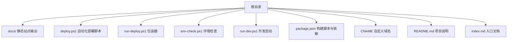
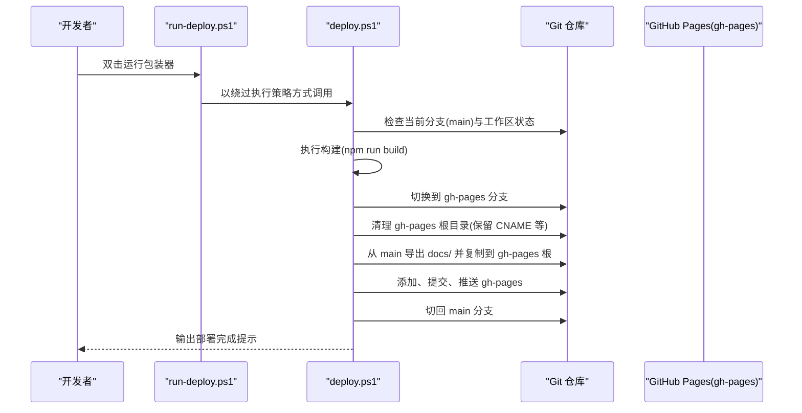
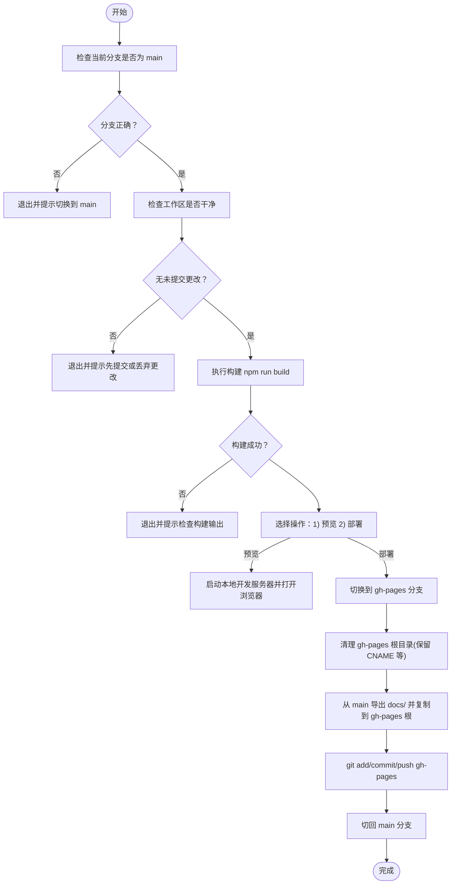
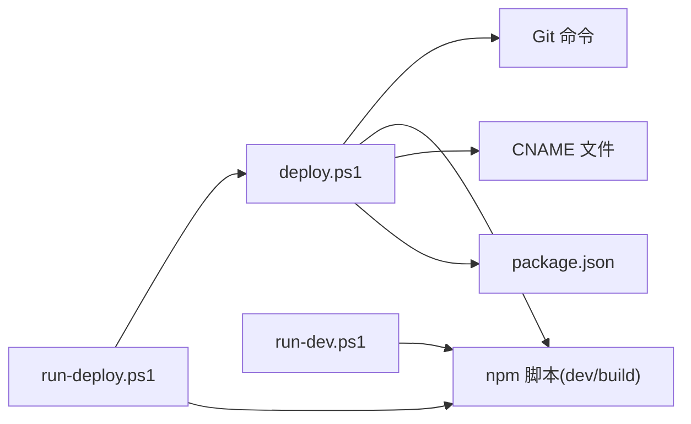
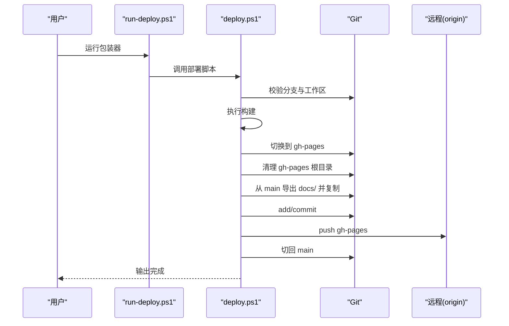

# 部署说明

<cite>
**本文引用的文件**
- [deploy.ps1](file://deploy.ps1)
- [run-deploy.ps1](file://run-deploy.ps1)
- [env-check.ps1](file://env-check.ps1)
- [run-dev.ps1](file://run-dev.ps1)
- [package.json](file://package.json)
- [CNAME](file://CNAME)
- [README.md](file://README.md)
- [index.md](file://index.md)
</cite>

## 目录
1. [简介](#简介)
2. [项目结构](#项目结构)
3. [核心组件](#核心组件)
4. [架构总览](#架构总览)
5. [详细组件分析](#详细组件分析)
6. [依赖关系分析](#依赖关系分析)
7. [性能与稳定性考量](#性能与稳定性考量)
8. [故障排除指南](#故障排除指南)
9. [结论](#结论)
10. [附录](#附录)

## 简介
本文件面向需要自动化部署 VuePress 文档站点的用户，系统性梳理从构建到发布的完整流程，重点解析以下脚本与文件的作用：
- 自动化部署脚本：deploy.ps1、run-deploy.ps1
- 开发环境检查脚本：env-check.ps1
- 开发启动脚本：run-dev.ps1
- 构建配置：package.json
- 自定义域名文件：CNAME
- 项目入口文档：README.md、index.md

目标是帮助你在 Windows PowerShell 环境下，安全、可重复地完成“构建 → 预览 → 发布到 gh-pages”的全流程，并提供部署前检查清单与常见问题排查方法。

## 项目结构
该仓库采用“根目录 + docs 输出目录”的典型 VuePress 结构：
- 根目录包含部署与开发辅助脚本、项目配置与自定义域名文件
- docs 目录为 VuePress 构建输出的静态站点资源
- CNAME 文件用于 GitHub Pages 绑定自定义域名

图表来源
- [deploy.ps1](file://deploy.ps1#L1-L156)
- [run-deploy.ps1](file://run-deploy.ps1#L1-L15)
- [env-check.ps1](file://env-check.ps1#L1-L103)
- [run-dev.ps1](file://run-dev.ps1#L1-L67)
- [package.json](file://package.json#L1-L19)
- [CNAME](file://CNAME#L1-L1)
- [README.md](file://README.md#L1-L3)
- [index.md](file://index.md#L1-L1)

章节来源
- [README.md](file://README.md#L1-L3)
- [package.json](file://package.json#L1-L19)

## 核心组件
- 自动化部署脚本 deploy.ps1
  - 功能：校验分支与工作区状态、执行构建、提供预览或部署选项、将 docs 内容同步至 gh-pages 并推送
- 包装器 run-deploy.ps1
  - 功能：以绕过执行策略的方式调用 deploy.ps1，便于直接双击运行
- 环境检查 env-check.ps1
  - 功能：检测 Node/npm/yarn/pnpm 等工具是否可用，以及项目 package.json 的关键信息与本地依赖安装状态
- 开发启动 run-dev.ps1
  - 功能：自动安装依赖并启动 VuePress 开发服务器，支持镜像源切换与本地/全局回退
- 构建配置 package.json
  - 功能：定义 dev/build 脚本与依赖，驱动 VuePress 构建与开发
- 自定义域名 CNAME
  - 功能：GitHub Pages 将该文件作为自定义域名标识，实现站点域名绑定

章节来源
- [deploy.ps1](file://deploy.ps1#L1-L156)
- [run-deploy.ps1](file://run-deploy.ps1#L1-L15)
- [env-check.ps1](file://env-check.ps1#L1-L103)
- [run-dev.ps1](file://run-dev.ps1#L1-L67)
- [package.json](file://package.json#L1-L19)
- [CNAME](file://CNAME#L1-L1)

## 架构总览
下图展示了从本地构建到 GitHub Pages 发布的整体流程，涵盖脚本之间的协作关系与数据流向。

图表来源
- [run-deploy.ps1](file://run-deploy.ps1#L1-L15)
- [deploy.ps1](file://deploy.ps1#L1-L156)

## 详细组件分析

### 自动化部署脚本 deploy.ps1
- 分支与工作区校验
  - 强制要求当前位于 main 分支，且工作区干净（无未提交更改），防止误部署
- 构建阶段
  - 调用 npm run build 生成 docs 静态站点；若失败则中止
- 交互选择
  - 提供预览与部署两种选项；预览会启动本地开发服务器并打开浏览器
- 部署到 gh-pages
  - 切换到 gh-pages 分支，清理非必要文件（保留 CNAME、README.md、LICENSE 等）
  - 使用 git archive 从 main 导出 docs/，复制到 gh-pages 根目录
  - git add/commit/push 推送至远程；最后切回 main

图表来源
- [deploy.ps1](file://deploy.ps1#L1-L156)

章节来源
- [deploy.ps1](file://deploy.ps1#L1-L156)

### 包装器 run-deploy.ps1
- 作用：确保在项目根目录找到 deploy.ps1 后，以绕过执行策略的方式运行，降低权限限制带来的阻塞
- 适用场景：双击直接运行，无需手动设置执行策略

章节来源
- [run-deploy.ps1](file://run-deploy.ps1#L1-L15)

### 环境检查 env-check.ps1
- 工具链检测：Node.js、npm、可选工具 winget、yarn、pnpm
- 项目信息：读取 package.json 中的 name、scripts、devDependencies、dependencies 等
- 本地依赖：检查 node_modules 与本地 vuepress 版本是否存在
- 下一步建议：缺失工具或依赖时给出安装与重试指引

章节来源
- [env-check.ps1](file://env-check.ps1#L1-L103)
- [package.json](file://package.json#L1-L19)

### 开发启动 run-dev.ps1
- 依赖安装：若缺少 node_modules 或本地 vuepress，先清理并尝试安装；必要时切换 npm 镜像源
- 启动优先级：优先使用本地 node_modules/.bin/vuepress，其次使用 npx 指定版本，最后回退到 npm run dev
- 输出与提示：打印安装与启动过程的关键信息，便于排障

章节来源
- [run-dev.ps1](file://run-dev.ps1#L1-L67)

### 构建配置 package.json
- scripts.dev 与 scripts.build：分别对应 VuePress 开发与构建命令
- 依赖：devDependencies 中包含 VuePress，dependencies 中包含 element-ui
- 用途：被 deploy.ps1 与 run-dev.ps1 调用，驱动构建与开发

章节来源
- [package.json](file://package.json#L1-L19)

### 自定义域名 CNAME
- 位置：根目录
- 作用：GitHub Pages 识别该文件作为自定义域名标识，将站点绑定到指定域名
- 注意：部署完成后需在 GitHub Pages 设置中启用自定义域名并配置 DNS 记录

章节来源
- [CNAME](file://CNAME#L1-L1)

## 依赖关系分析
- 脚本耦合
  - run-deploy.ps1 依赖 deploy.ps1 存在与可执行
  - deploy.ps1 依赖 Git 命令与 npm 脚本
  - run-dev.ps1 依赖 package.json 的 scripts 字段与本地依赖
- 外部依赖
  - Node.js/npm/yarn/pnpm
  - Git
  - GitHub 远程仓库（origin）

图表来源
- [run-deploy.ps1](file://run-deploy.ps1#L1-L15)
- [deploy.ps1](file://deploy.ps1#L1-L156)
- [run-dev.ps1](file://run-dev.ps1#L1-L67)
- [package.json](file://package.json#L1-L19)
- [CNAME](file://CNAME#L1-L1)

章节来源
- [run-deploy.ps1](file://run-deploy.ps1#L1-L15)
- [deploy.ps1](file://deploy.ps1#L1-L156)
- [run-dev.ps1](file://run-dev.ps1#L1-L67)
- [package.json](file://package.json#L1-L19)

## 性能与稳定性考量
- 构建时间优化
  - 保持 node_modules 安装稳定，避免重复安装
  - 在网络受限环境下，可考虑使用 npm 镜像源加速
- 部署稳定性
  - 严格的工作区状态检查可避免误推脏数据
  - 部署前导出 docs/ 再覆盖 gh-pages 根目录，减少不必要的文件变更
- 可靠性建议
  - 使用包装器 run-deploy.ps1 降低执行策略对部署的影响
  - 在 CI 环境中复用相同逻辑，确保一致性

[本节为通用建议，不直接分析具体文件]

## 故障排除指南
- 权限问题（无法执行脚本）
  - 现象：双击 run-deploy.ps1 无响应或报错
  - 处理：使用 run-deploy.ps1 包装器运行；若仍失败，检查 PowerShell 执行策略
  - 参考路径：[run-deploy.ps1](file://run-deploy.ps1#L1-L15)
- Git 分支或状态不符
  - 现象：脚本报错提示不在 main 分支或工作区不干净
  - 处理：切换到 main 并提交/丢弃未提交更改后再运行
  - 参考路径：[deploy.ps1](file://deploy.ps1#L12-L38)
- 构建失败
  - 现象：npm run build 抛错
  - 处理：查看构建输出；使用 env-check.ps1 检查 Node/npm 状态；使用 run-dev.ps1 验证开发环境
  - 参考路径：[deploy.ps1](file://deploy.ps1#L40-L53)、[env-check.ps1](file://env-check.ps1#L1-L103)、[run-dev.ps1](file://run-dev.ps1#L1-L67)
- 未找到 docs 输出目录
  - 现象：构建成功但找不到 docs 目录
  - 处理：检查 VuePress 配置；确认构建脚本输出路径
  - 参考路径：[deploy.ps1](file://deploy.ps1#L47-L51)
- 无法切换到 gh-pages 分支
  - 现象：提示 gh-pages 不存在
  - 处理：在本地创建并关联远程 gh-pages 分支，或在 GitHub 上启用 Pages
  - 参考路径：[deploy.ps1](file://deploy.ps1#L95-L100)
- 推送失败（网络/凭据）
  - 现象：git push origin gh-pages 失败
  - 处理：检查网络连通性、SSH/Git 凭据；必要时改用 HTTPS 并输入凭据
  - 参考路径：[deploy.ps1](file://deploy.ps1#L145-L149)
- 自定义域名未生效
  - 现象：访问自定义域名 404 或未绑定
  - 处理：确认 CNAME 文件内容正确；在 GitHub Pages 设置中启用自定义域名并配置 DNS
  - 参考路径：[CNAME](file://CNAME#L1-L1)

章节来源
- [run-deploy.ps1](file://run-deploy.ps1#L1-L15)
- [deploy.ps1](file://deploy.ps1#L12-L156)
- [env-check.ps1](file://env-check.ps1#L1-L103)
- [run-dev.ps1](file://run-dev.ps1#L1-L67)
- [CNAME](file://CNAME#L1-L1)

## 结论
通过 deploy.ps1、run-deploy.ps1、env-check.ps1、run-dev.ps1 与 package.json 的协同，本项目实现了从构建到发布的自动化流程。结合 CNAME 文件，可实现稳定的 GitHub Pages 自定义域名发布。建议在每次部署前使用 env-check.ps1 进行环境核验，并遵循部署前检查清单，以提升成功率与可重复性。

[本节为总结性内容，不直接分析具体文件]

## 附录

### 部署前检查清单
- 环境依赖
  - Node.js 与 npm 可用，版本满足要求
  - package.json 存在且包含 dev/build 脚本
  - 本地已安装依赖（node_modules 存在）
- Git 配置
  - 当前位于 main 分支
  - 工作区干净（无未提交更改）
  - 已配置并可访问远程 origin
- 分支状态
  - gh-pages 分支存在（本地或远程）
- 自定义域名
  - CNAME 文件存在且内容正确
  - GitHub Pages 设置中已启用自定义域名

章节来源
- [env-check.ps1](file://env-check.ps1#L1-L103)
- [deploy.ps1](file://deploy.ps1#L12-L100)
- [package.json](file://package.json#L1-L19)
- [CNAME](file://CNAME#L1-L1)

### 关键流程时序（部署到 gh-pages）

图表来源
- [run-deploy.ps1](file://run-deploy.ps1#L1-L15)
- [deploy.ps1](file://deploy.ps1#L90-L156)