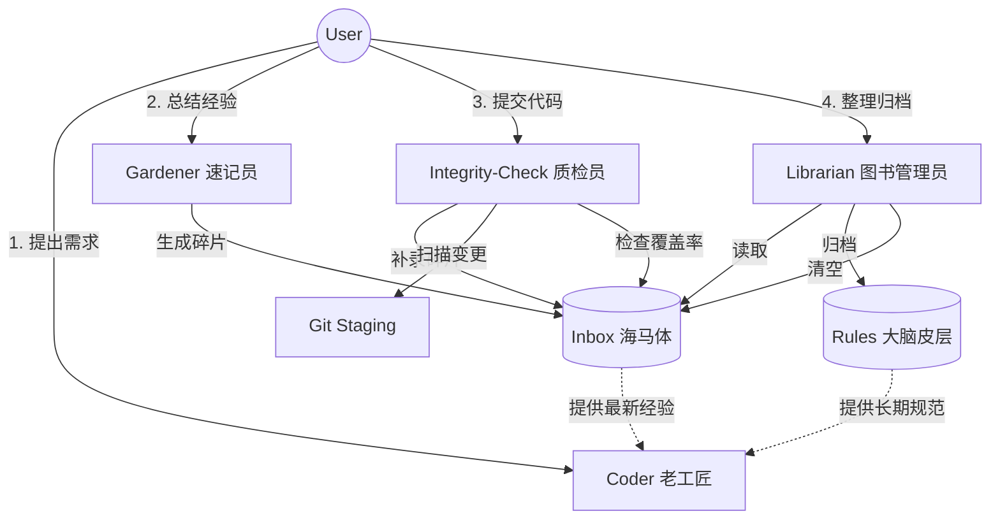

# MeeWoo 项目使用帮助与目录指南 (HELP.md)

欢迎使用 MeeWoo！本文档旨在帮助你快速了解项目结构、各目录功能以及如何使用本项目的知识引擎。

## 1. 核心目录结构说明

| 目录路径 | 中文名称 | 功能与用途 |
| :--- | :--- | :--- |
| **`.trae/`** | **Trae 配置与知识库** | **项目的“大脑”**。存放 AI 配置、知识库规则、技能包和设计文档。 |
| ├── `rules/` | 规则库 | 存放项目的技术规范、代码风格和模块文档。AI 写代码前会查阅这里。 |
| ├── `skills/` | 技能包 | 存放 AI 的能力扩展 (如 `coder`, `knowledge-gardener`)。 |
| ├── `specs/` | 设计规范 | 存放功能开发的设计文档 (Spec, Tasks, Checklist)。 |
| └── `documents/` | 项目文档 | 存放项目产生的各类技术文档和架构建议书。 |
| **`src/`** | **源代码目录** | **项目的“躯干”**。存放所有前端代码、静态资源和业务逻辑。 |
| ├── `assets/` | 静态资源 | 图片、CSS 样式表、演示用的 SVGA/PNG 素材。 |
| ├── `js/` | JavaScript 源码 | 核心逻辑代码。 |
| │   ├── `core/` | 核心模块 | 画布引擎 (Konva)、编辑器核心逻辑。 |
| │   ├── `service/` | 服务模块 | 媒体处理 (FFmpeg)、格式转换 (GIF/MP4)、文件导出。 |
| │   ├── `components/` | UI 组件 | 右侧面板、弹窗等 Vue 组件逻辑。 |
| │   ├── `mixins/` | 混入逻辑 | Vue Mixins (如 `panel-mixin.js` 用于面板管理)。 |
| │   └── `lib/` | 第三方库 | 存放本地化的依赖库 (ffmpeg.wasm, svga.min.js 等)。 |
| └── `gadgets/` | 小工具 | 独立的小工具页面 (如 PNG 压缩、乱码修复)。 |
| **`ai_protocol_hub/`** | **AI 协议中心** | (旧版/保留) 存放早期的 AI 协作规则和脚本，部分已被 `.trae/rules` 取代。 |
| **`docs/`** | **文档/构建产物** | 通常用于 GitHub Pages 部署的静态文件输出目录。 |

## 2. 根目录关键文件说明

| 文件名 | 用途 |
| :--- | :--- |
| `README.md` | 项目主页，介绍项目背景、安装和启动方法。 |
| `HELP.md` | **(本文档)** 项目目录结构与使用指南。 |
| `INDEX.md` | 项目功能索引，帮助 AI 快速定位代码位置。 |
| `UPDATE_LOG.md` | **变更日志**。记录每次代码修改的内容，AI 会自动维护。 |
| `CODE_STYLE.md` | 原始代码风格指南 (已被 `.trae/rules/core/coding-style.ts.md` 增强)。 |
| `package.json` | npm 包管理文件，定义了项目依赖和构建脚本。 |

## 3. 知识引擎原理与机制

MeeWoo 知识引擎采用 **“规则 (Rules) + 技能 (Skills)”** 的双引擎架构，旨在让 AI 像人类开发者一样“有记忆”、“守规矩”。

### 3.1 核心原理：类脑记忆机制 (Brain-Inspired Memory)

MeeWoo 知识引擎模仿了人脑的记忆处理流程，分为三级存储：

1.  **工作记忆 (Working Memory)** -> **上下文窗口**
    *   你正在和 AI 聊天的内容，容量有限，关掉就忘。
2.  **海马体 (Hippocampus)** -> **Inbox (`.trae/rules/inbox/`)**
    *   **短期记忆区**。存放当天产生的新经验、新 Bug 修复记录。
    *   特点：写入快，未整理，碎片化。
3.  **大脑皮层 (Cortex)** -> **Rules (`.trae/rules/modules/`)**
    *   **长期记忆区**。存放经过验证、结构化的项目规范。
    *   特点：读取快，结构严谨，永久有效。

### 3.2 运作机制：闭环进化

1.  **感知 (Gardener)**：开发过程中，AI 将新经验快速记入 **Inbox**（海马体）。
2.  **执行 (Coder)**：写代码时，AI 同时调取 **Rules**（皮层）和 **Inbox**（海马体），确保用到最新知识。
3.  **睡眠整理 (Librarian)**：系统空闲时，AI 将 Inbox 的碎片整理、归档进 Rules，并清空 Inbox，完成记忆固化。

### 3.3 Skill 角色图鉴 (Skill Roles)

为了方便理解，我们将每个 Skill 比喻为一个特定的职业角色：

| Skill 名称 | 中文代号 | 形象比喻 | 职责 (Job Description) |
| :--- | :--- | :--- | :--- |
| **`coder`** | **老工匠** | **前额叶 (执行)** | **写代码的**。干活前先查规矩 (Rules)，也会瞟一眼备忘录 (Inbox)，确保活儿做得漂亮且合规。 |
| **`knowledge-gardener`** | **速记员** | **海马体 (感知)** | **记笔记的**。你随口说的经验、踩过的坑，它立马记在便利贴 (Inbox) 上，不让灵感溜走。 |
| **`knowledge-librarian`** | **图书管理员** | **睡眠整理 (内化)** | **整理书架的**。趁你休息时，把便利贴分类、誊写进正式手册 (Rules)，把没用的扔掉。 |
| **`integrity-check`** | **质检员** | **免疫系统 (防御)** | **守大门的**。提交代码前主动扫描变更，若发现未记经验会**自动帮你补录**，通过后**自动生成规范的提交信息**并提交。 |

### 3.4 知识引擎运转全流程 (The Flow)

#### 环节详解

1.  **输入环节 (Input)**
    *   **负责人**: **Gardener (速记员)**
    *   **触发条件**: 用户主动总结经验，或 Integrity-Check 发现漏记。
    *   **执行标准**: 
        *   **预切分**: 一个文件只讲一件事。
        *   **选模板**: 修 Bug 用 `inbox_note`，学知识用 `inbox_knowledge`。
    *   **产物**: Inbox 中的碎片文件 (`.md`)。

2.  **验证环节 (Verification)**
    *   **负责人**: **Integrity-Check (质检员)**
    *   **触发条件**: 用户执行 `git commit` 或请求提交代码。
    *   **执行标准**:
        *   **未归档检查**: 必须有未被 Librarian 处理的 Inbox 笔记。
        *   **相关性检查**: 笔记关键词必须覆盖代码变更模块。
    *   **产物**: 规范的 Commit Message (含 `Ref` 链接)。

3.  **归档环节 (Archiving)**
    *   **负责人**: **Librarian (图书管理员)**
    *   **触发条件**: 系统空闲时或用户主动请求。
    *   **执行标准**:
        *   **分级实证**: 核心规则必须查阅代码库验证真伪。
        *   **项目相关性**: 通用建议必须符合 `package.json` 技术栈。
        *   **模板匹配**: 自动选择 Concept/Guide/Reference 模板。
    *   **产物**: Rules 中的结构化文档 (`.ts.md`)。

### 3.5 为什么需要它？

*   **解决“AI 健忘”**：普通 AI 聊完就忘，知识引擎让它拥有“项目记忆”。
*   **保证一致性**：无论你隔多久再开发，AI 都会遵守同一套代码风格。
*   **经验复用**：以前踩过的坑，通过自动归档，以后永远不会再踩。

## 4. 如何使用 AI 知识引擎

本项目内置了强大的 AI 知识引擎，你可以通过以下指令让 AI 帮你干活：

### 场景 A：我要写新功能 / 改 Bug
**指令**：`/skill coder [你的需求]`
*   **示例**：“/skill coder 我想优化一下 Canvas 的拖拽性能，有点卡顿。”
*   **AI 动作**：自动查阅 **Rules (长期记忆)** 中的规范，并快速扫描 **Inbox (短期记忆)** 里的最新经验，确保代码既合规又避坑。

### 场景 B：我想总结经验 / 记录 Bug
**指令**：`/skill knowledge-gardener [你的总结]`
*   **示例**：“/skill knowledge-gardener 刚才解决的那个 FFmpeg 内存泄漏问题，把解决方法记录下来。”
*   **AI 动作**：快速提取经验，生成一个碎片文件暂存到 **Inbox** (海马体)，不打断你的开发心流。

### 场景 C：提交代码前检查
**指令**：`/skill integrity-check` (或者直接说“帮我提交代码”)
*   **AI 动作**：
    1.  **自动扫描**：检查代码变更是否已在 Inbox 有对应笔记。
    2.  **交互修复**：若无笔记，AI 会问你“要不要补录？”，确认后自动生成笔记。
    3.  **自动提交**：生成符合 Angular 规范的 Commit Message（含 Inbox 关联链接），并静默提交。

### 场景 D：整理知识库 (睡眠整理)
**指令**：`/skill knowledge-librarian`
*   **示例**：“/skill knowledge-librarian 整理一下这周的 Inbox。”
*   **AI 动作**：像图书管理员一样，把 Inbox 里的碎片文件分类、抽象、合并进长期规则库 (Rules)，并清空 Inbox。建议每周运行一次。

## 5. 常见问题 (Q&A)

*   **Q: 我看不懂代码，怎么知道文件放哪了？**
    *   A: 直接问 AI：“xxx 功能的代码在哪里？” 它会查阅 `INDEX.md` 告诉你。
*   **Q: `.trae` 目录下的文件我可以删吗？**
    *   A: **最好不要删**。那是 AI 的记忆库，删了它就变“笨”了。
*   **Q: `src/js/lib/` 里的文件是干嘛的？**
    *   A: 那些是第三方工具库（比如处理视频的 FFmpeg，画图的 Konva），通常不需要修改。

---
*文档更新时间：2026-03-05*
