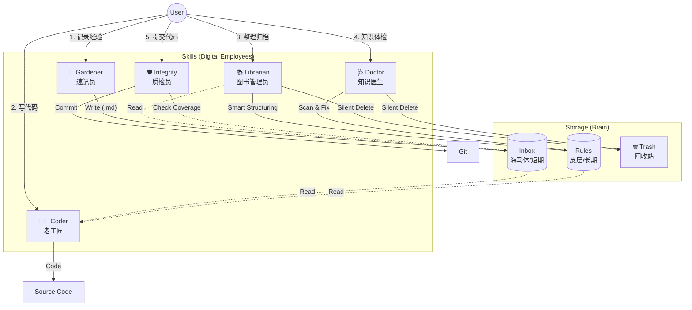

# MeeWoo 知识引擎与开发指南 (v6.0)

> **欢迎使用 MeeWoo！**
> 本项目不仅仅是一套代码，更内置了一套**类脑知识引擎 (Brain-Inspired Knowledge Engine)**。
> 本文档是您理解、使用和驾驭这套引擎的终极指南。

## 1. 什么是“知识引擎”？

想象一下，如果您的 AI 助手拥有记忆，能记住上次踩的坑，能遵守团队的即时约定，还能随着项目发展自动进化——这就是 MeeWoo 知识引擎的核心愿景。

它模仿人脑的**记忆-巩固-免疫**机制，构建了一套完整的研发闭环：

| 脑区 (Brain Region) | 对应组件 (Component) | 功能 (Function) | 状态 (State) |
| :--- | :--- | :--- | :--- |
| **海马体** (Hippocampus) | **Inbox (`.trae/rules/inbox/`)** | **短期记忆**。快速暂存碎片化经验、Bug 修复记录。 | 写入快，未整理 |
| **大脑皮层** (Cortex) | **Rules (`.trae/rules/modules/`)** | **长期记忆**。存放经过结构化、验证的规范与知识。 | 读取快，结构化 |
| **免疫系统** (Immune System) | **Doctor (`.trae/skills/`)** | **健康维护**。定期体检、去重、修复格式、清除垃圾。 | 自动化，自愈 |

---

## 2. 技能角色图鉴 (Skill Roles)

为了让这套引擎运转起来，我们配备了 5 位“数字员工”。请像指挥团队一样指挥它们：

### 👨‍💻 Coder (老工匠)
> **职责**: 写代码 (Coding)
> **口头禅**: *"慢工出细活，干活先查书。"*

- **行为**: 在写代码前，必先查阅 **Rules** (规范) 和 **Inbox** (新经验)。
- **产出**: 高质量、合规的代码。
- **触发**: `/skill coder` 或 "写一个..."

### 📝 Knowledge Gardener (速记员)
> **职责**: 记笔记 (Capture)
> **口头禅**: *"好记性不如烂笔头。"*

- **行为**: 快速将您随口说的经验、踩过的坑记录到 **Inbox** (海马体)。
- **产出**: 碎片化的 Markdown 笔记。
- **触发**: "把这个记下来" / "记录经验" / "生成笔记"

### 📚 Knowledge Librarian (图书管理员)
> **职责**: 整理归档 (Consolidate)
> **口头禅**: *"把杂乱变有序，把短期变长期。"*

- **行为**: 将 Inbox 里的碎片**智能结构化** (Smart Structuring)，归档进 **Rules** (皮层)，并执行静默清理。
- **产出**: 标准化的 TypeScript Interface 规则模块。
- **触发**: "整理 inbox" / "整理经验" / "归档笔记"

### 🩺 Knowledge Doctor (知识医生)
> **职责**: 诊断治疗 (Maintain)
> **口头禅**: *"早发现，早治疗，拒绝知识腐烂。"*

- **行为**: 对知识库进行全量体检，修复格式错误、去除重复内容、拆分过大文件 (Fission)。
- **产出**: 健康、整洁的知识库目录。
- **触发**: "整理知识库" / "检查知识库" / "知识体检"

### 🛡️ Integrity Check (质检员)
> **职责**: 守门与发布 (Verify & Release)
> **口头禅**: *"无经验，不提交。"*

- **行为**: 
  1. **提交前**: 检查代码变更是否已在 Inbox 留下记录。若无，强制要求补录。
  2. **提交时**: 自动生成符合规范的 Commit Message。
  3. **发布时**: 一键合并 Release PR，触发发版。
- **触发**: "帮我提交代码" / "帮我发版"

---

## 3. 标准工作流 (Workflows)

### 3.1 知识引擎运转全景图 (The Big Picture)

### 3.2 典型剧本 (Scenarios)

跟随以下剧本，您将体验到最顺畅的 AI 辅助开发流程：

### 剧本 A: 开发新功能 (Feature Dev)
1.  **唤起工匠**: "我想开发一个 Canvas 拖拽功能。"
    *   -> `Coder` 查阅 `modules/graphics/konva` 规则，开始编码。
2.  **记录灵感**: (开发中发现一个性能坑) "注意，Konva 的 Layer 层级太深会卡顿。"
    *   -> `Gardener` 迅速记入 Inbox，不打断您的思路。
3.  **提交代码**: "功能写好了，提交吧。"
    *   -> `Integrity Check` 扫描代码，发现您已记录了性能坑，验证通过，自动提交。

### 剧本 B: 知识库维护 (Maintenance)
1.  **闲暇整理**: (项目空闲时) "整理一下最近的经验。"
    *   -> `Librarian` 启动，将 Inbox 里的零散笔记合并到 `graphics/konva.ts.md` 中，并清空 Inbox。
2.  **定期体检**: "检查一下知识库健康度。"
    *   -> `Doctor` 扫描全库，发现 `konva.ts.md` 超过 300 行，自动建议拆分为 `konva/core.ts.md` 和 `konva/events.ts.md`。

---

## 4. 目录结构导航 (Directory Map)

快速找到您需要的文件：

| 路径 | 说明 |
| :--- | :--- |
| **`.trae/`** | **引擎核心** |
| ├── `rules/` | **知识存储区** |
| │   ├── `inbox/` | 海马体 (Gardener 的工作区) |
| │   └── `modules/` | 大脑皮层 (Librarian/Doctor 的管辖区) |
| ├── `skills/` | **技能定义区** (存放各角色的指令与脚本) |
| ├── `logs/` | **日志区** (UPDATE_LOG, error-log) |
| └── `trash/` | **回收站** (所有“静默删除”的文件都在这里，安全第一) |
| **`src/`** | **业务代码** (Vue, JS, Assets) |

---

## 5. 常见问题 (Q&A)

*   **Q: 我可以直接修改 `.trae/rules` 下的文件吗？**
    *   A: 可以，但建议通过 `Doctor` 或 `Librarian` 来维护，以保证格式统一 (Frontmatter + TS Interface)。
*   **Q: 为什么提交代码时会报错？**
    *   A: 可能是 `Integrity Check` 发现您修改了核心代码但没有记录经验。请按提示选择“自动补录”。
*   **Q: 文件被 AI 删除了怎么办？**
    *   A: 别慌！去 `.trae/trash/` 看看，所有被技能删除的文件都会在那里保留备份（带时间戳）。

---
*MeeWoo Knowledge Engine v6.0 | Powered by Trae AI*
