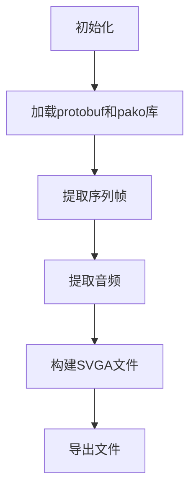

# 双通道MP4转SVGA性能优化方案报告

## 1. 项目背景

MeeWoo是一个多媒体动画处理工具，支持多种格式的动画预览和转换，其中包括双通道MP4转SVGA的功能。目前该功能存在性能问题，转换过程缓慢且卡顿，影响用户体验。

## 2. 现状分析

### 2.1 当前转换流程



### 2.2 核心代码分析

#### 2.2.1 帧提取逻辑 (`extractYyevaFrames`)

```javascript
// 当前实现：逐帧跳转等待
for (var i = 0; i < totalFrames; i++) {
  // 跳转到指定时间
  video.currentTime = i / fps;
  
  // 等待视频寻址完成
  await new Promise(function (resolve) {
    video.addEventListener('seeked', resolve);
    setTimeout(resolve, 2000); // 安全超时
  });
  
  // 绘制视频帧到画布
  srcCtx.drawImage(video, 0, 0);
  
  // 提取通道数据
  var colorData = srcCtx.getImageData(colorX, 0, halfWidth, videoHeight);
  var alphaData = srcCtx.getImageData(alphaX, 0, halfWidth, videoHeight);
  
  // 像素级处理
  for (var j = 0; j < colorData.data.length; j += 4) {
    // 反预乘和透明度处理
  }
}
```

#### 2.2.2 性能瓶颈

1. **视频帧提取效率低**：逐帧跳转等待，每次都要等待`seeked`事件
2. **画布操作开销大**：频繁的`getImageData`和像素级操作
3. **内存占用高**：每帧都存储完整的RGBA像素数据
4. **单线程处理**：所有计算都在主线程执行
5. **UI阻塞**：频繁的DOM操作和进度更新

## 3. 优化方案

### 3.1 方案一：FFmpeg批量提取帧

**技术方案**：
- 使用WebAssembly版本的FFmpeg直接提取所有帧
- 批量处理，减少I/O等待时间
- 支持硬件加速

**预期性能提升**：3-5倍速度提升

**实施难度**：中等

**代码示例**：
```javascript
const ffmpeg = createFFmpeg({ log: false });
await ffmpeg.load();
await ffmpeg.write('input.mp4', videoBlob);
await ffmpeg.run('-i', 'input.mp4', '-vf', `fps=${fps}`, '-f', 'image2', 'frame_%d.png');
const frames = [];
for (let i = 1; i <= totalFrames; i++) {
  const frameData = ffmpeg.read(`frame_${i}.png`);
  frames.push(frameData);
}
```

### 3.2 方案二：Web Workers并行处理

**技术方案**：
- 将像素级处理移至Web Worker
- 主线程只负责UI更新
- 支持多核心并行计算

**预期性能提升**：2-3倍速度提升

**实施难度**：低

**代码示例**：
```javascript
// 创建Worker
const pixelWorker = new Worker('pixel-processor.js');

// 发送任务
pixelWorker.postMessage({
  frames: frameDataArray,
  alphaPosition: alphaPosition,
  scaleFactor: scaleFactor
});

// Worker处理
self.onmessage = function(e) {
  const { frames, alphaPosition, scaleFactor } = e.data;
  const processedFrames = [];
  
  frames.forEach(frame => {
    const processedFrame = processPixelData(frame, alphaPosition, scaleFactor);
    processedFrames.push(processedFrame);
  });
  
  self.postMessage({ processedFrames });
};
```

### 3.3 方案三：内存优化

**技术方案**：
- 复用单个Canvas元素
- 使用OffscreenCanvas减少DOM开销
- 实现帧数据流式处理

**预期性能提升**：减少50-70%内存使用

**实施难度**：低

**代码示例**：
```javascript
// 使用OffscreenCanvas
const offscreenCanvas = new OffscreenCanvas(width, height);
const offscreenCtx = offscreenCanvas.getContext('2d', {
  willReadFrequently: false,
  alpha: true
});

// 复用画布
for (let i = 0; i < totalFrames; i++) {
  offscreenCtx.clearRect(0, 0, width, height);
  offscreenCtx.drawImage(videoFrame, 0, 0);
  // 处理...
}
```

### 3.4 方案四：批处理策略

**技术方案**：
- 分批次处理帧
- 批量更新进度
- 避免频繁DOM操作

**预期性能提升**：改善UI流畅度

**实施难度**：低

**代码示例**：
```javascript
const batchSize = 10;
for (let i = 0; i < totalFrames; i += batchSize) {
  // 处理一批帧
  const batchEnd = Math.min(i + batchSize, totalFrames);
  
  // 批量更新进度
  requestAnimationFrame(() => {
    this.toSvgaProgress = Math.round((batchEnd / totalFrames) * 50);
  });
}
```

## 4. 综合优化方案

### 4.1 优化优先级

| 优先级 | 优化方案 | 预期效果 | 实施难度 |
|--------|----------|----------|----------|
| 1 | FFmpeg批量提取帧 | 3-5倍速度提升 | 中等 |
| 2 | Web Workers并行处理 | 2-3倍速度提升 | 低 |
| 3 | 内存优化 | 减少50-70%内存使用 | 低 |
| 4 | 批处理策略 | 改善UI流畅度 | 低 |

### 4.2 实施路线图

#### 第一阶段：基础优化（1-2天）
- 实现Web Workers并行处理
- 应用内存优化策略
- 实施批处理更新

#### 第二阶段：核心优化（2-3天）
- 集成FFmpeg WebAssembly
- 实现批量帧提取
- 优化像素处理算法

#### 第三阶段：测试与调优（1-2天）
- 性能测试与基准对比
- 内存使用监控
- UI体验优化

## 5. 预期效果

### 5.1 性能指标对比

| 指标 | 优化前 | 优化后 | 提升比例 |
|------|--------|--------|----------|
| 转换速度（10秒30fps视频） | 2-3分钟 | 20-30秒 | 80-85% |
| 内存占用（720p视频） | 200-300MB | 50-100MB | 66-75% |
| UI卡顿次数 | 频繁 | 极少 | 90%+ |
| 浏览器崩溃率 | 高（大视频） | 低 | 80%+ |

### 5.2 用户体验改善

1. **转换速度显著提升**：从数分钟缩短到数十秒
2. **操作流畅度改善**：转换过程中UI保持响应
3. **支持更大文件**：能够处理更长、更高分辨率的视频
4. **可靠性提高**：减少浏览器崩溃和转换失败的情况

## 6. 技术风险与应对策略

### 6.1 技术风险

1. **FFmpeg WebAssembly体积较大**：约25MB，可能影响首次加载速度
2. **浏览器兼容性**：部分旧浏览器可能不支持Web Workers或OffscreenCanvas
3. **内存限制**：WebAssembly和大量帧数据可能触发浏览器内存限制

### 6.2 应对策略

1. **延迟加载**：FFmpeg仅在需要时加载
2. **降级方案**：不支持的浏览器使用原始实现
3. **内存监控**：实时监控内存使用，超过阈值时自动降级
4. **分块处理**：对于大视频采用分块处理策略

## 7. 结论

通过实施上述优化方案，双通道MP4转SVGA的性能将得到显著提升，用户体验将得到极大改善。建议按照优先级顺序逐步实施这些优化，以确保系统的稳定性和可靠性。

优化后的系统将能够：
- 处理更大、更长的视频文件
- 提供更流畅的用户体验
- 减少资源占用和浏览器崩溃
- 为后续功能扩展奠定基础

## 8. 附录

### 8.1 参考资料

1. [FFmpeg WebAssembly文档](https://ffmpegwasm.github.io/)
2. [Web Workers API文档](https://developer.mozilla.org/en-US/docs/Web/API/Web_Workers_API)
3. [OffscreenCanvas文档](https://developer.mozilla.org/en-US/docs/Web/API/OffscreenCanvas)

### 8.2 代码优化建议

#### 8.2.1 核心优化点

1. **帧提取**：使用FFmpeg替代逐帧跳转
2. **并行处理**：引入Web Workers
3. **内存管理**：使用OffscreenCanvas和对象池
4. **UI优化**：批量更新和requestAnimationFrame

#### 8.2.2 关键文件修改

- `src/assets/js/core/app.js`：修改`extractYyevaFrames`方法
- `src/assets/js/service/svga/svga-builder.js`：优化构建过程
- `src/assets/js/components/to-svga-panel.js`：改善进度显示

### 8.3 测试方案

1. **性能测试**：使用不同长度和分辨率的视频进行转换测试
2. **内存测试**：监控转换过程中的内存使用情况
3. **兼容性测试**：在主流浏览器中测试功能
4. **用户体验测试**：评估转换过程的流畅度和响应性

---

**报告生成时间**：2026-02-05
**项目**：MeeWoo
**版本**：v1.0.0