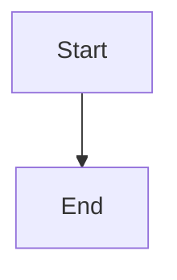

# [ModuleName] 概念解析 (Concept)

```typescript
/**
 * [ModuleName] 概念模型
 * @description [摘要: 一句话总结该技术概念的核心价值]
 */
export interface [ModuleName]Concept {
  /**
   * 核心定义
   * @description 清晰、准确的概念定义
   */
  definition: string;

  /**
   * 核心原理
   * @description 支撑该概念的关键机制
   */
  principles: string[];

  /**
   * 适用场景
   * @description 推荐使用该技术的场景
   */
  useCases: {
    /** 推荐场景 (Best for) */
    recommended: string[];
    /** 不推荐场景 (Avoid when) */
    avoid: string[];
  };

  /**
   * 关键术语表
   * @description 领域专用术语定义
   */
  terminology: Record<string, string>;
}
```

## 1. 核心定义 (Definition)
[Definition Content]

## 2. 核心原理 (Core Principles)
- **Principle 1**: ...
- **Principle 2**: ...

## 3. 架构图解 (Architecture)


## 4. 适用场景 (Use Cases)
- ✅ **Recommended**: ...
- ❌ **Avoid**: ...
