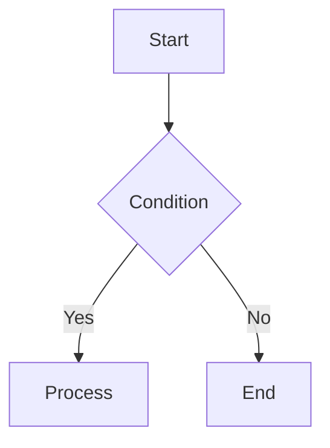

# [ModuleName] 概念解析 (Concept)

> **摘要**: [一句话总结该技术概念的核心价值或定义]

## 1. 核心定义 (Definition)
[清晰、准确地定义该概念是什么]

## 2. 核心原理 (Core Principles)
- **原理 1**: [Description]
- **原理 2**: [Description]

## 3. 架构图解 (Architecture)
*(使用 Mermaid 或文本描述)*

## 4. 关键术语 (Key Terminology)
| 术语 | 定义 | 备注 |
| :--- | :--- | :--- |
| `Term A` | [Definition] | - |

## 5. 适用场景 (Use Cases)
- ✅ **适用**: [场景 A]
- ❌ **不适用**: [场景 B]

## 6. 限制与约束 (Constraints)
1. [Constraint 1]
2. [Constraint 2]

## 7. 关联模块 (Related Modules)
- [Module A](modules/module-a.ts.md)
